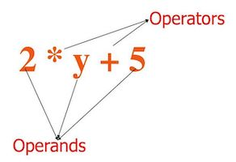

# Python Basics


[Python](https://www.python.org/) is a programming language, first released in 1991.

As many programming languages, Python has evolved over the time. Python 3, released 2008, was a major revision of the language that is not completely [backward-compatible](https://en.wikipedia.org/wiki/Backward_compatibility) with Python 2, while there is a great amount of code initially written for Python 2. At Intek, all the source code you will write MUST be compatible with **Python 3**.

## Preamble

You will start using Python with your terminal.

Make sure you are using **Python 3**, and not Python 2.

Check the version of your Python interpreter, i.e., the application that runs your Python code.

For example:

```bash
$ python --version
Python 2.7.10
$ python
Python 2.7.10 (default, Feb 22 2019, 21:55:15)
[GCC 4.2.1 Compatible Apple LLVM 10.0.1 (clang-1001.0.37.14)] on darwin
Type "help", "copyright", "credits" or "license" for more information.
>>>
```

This is the wrong version of Python. In that case, you should try running the `python3` command:

```bash
$ python3 --version
Python 3.7.3
$ python3
Python 3.7.3 (default, Mar 27 2019, 09:23:15)
[Clang 10.0.1 (clang-1001.0.46.3)] on darwin
Type "help", "copyright", "credits" or "license" for more information.
>>>
```

Better!


## Primitive Data Types

[Programming](https://en.wikipedia.org/wiki/Computer_program), and more generally speaking [computer sciences](https://en.wikipedia.org/wiki/Computer_science), is the Art of manipulating and transforming data.

A datum represents a **value** of a certain [**type**](https://en.wikipedia.org/wiki/Data_type). Python natively supports several [primitive data types](https://en.wikipedia.org/wiki/Primitive_data_type). We provide hereafter a limited list:

| Data Type                                                                   | Description                                                                                                                    | Examples                                                                                                                     |
| --------------------------------------------------------------------------- | ------------------------------------------------------------------------------------------------------------------------------ | ---------------------------------------------------------------------------------------------------------------------------- |
| [Integer](https://en.wikipedia.org/wiki/Integer) (`int`)                    | Any positive and negative counting numbers, as well as zero                                                                    | `0`, `1`, `3`, `-2`, `-5`, etc.                                                                                              |
| [Boolean](https://en.wikipedia.org/wiki/Boolean_data_type) (`bool`)         | Indicate whether a [fact/proposition is true or false](https://www.youtube.com/watch?v=r526yum0EYQ)                            | [`True` and `False`](https://www.youtube.com/watch?v=9OK32jb_TdI)                                                            |
| [Float](https://en.wikipedia.org/wiki/Floating-point_arithmetic) (`float`)  | Any real numbers                                                                                                               | `3.1415`, `-1.4142135623730951`, etc., and even `0.0`, `-1.0`, etc., which Python considers as **floats**, not **integers**. |
| [String](<https://en.wikipedia.org/wiki/String_(computer_science)>) (`str`) | any [sequence of 0 or more characters](https://www.youtube.com/watch?v=iAzShkKzpJo), defined between 2 single or double quotes | "Hello, world!, 'How are you doing?', "What's your name?", '"Sa mưa giông" tiếng Anh la gì ?', "", etc.                      |

There is a special Python value: `None`. It represents... well... nothing, an empty state, a null value. `None` is frequently used to represent the absence of a value. The type of the `None` value is `NoneType`.

To determine the [type](https://www.youtube.com/watch?v=_87ASgggEg0) of a given value, use the [Python built-in function](https://docs.python.org/3/library/functions.html) [`type()`](https://docs.python.org/3/library/functions.html#type).

Example:

```python
>>> type(1)
<class 'int'>
>>> type(True)
<class 'bool'>
>>> type(2.25)
<class 'float'>
>>> type("Hello, world!")
<class 'str'>
>>> type(None)
<class 'NoneType'>
```

To check whether the a value if of a given type, use the [Python built-in function](https://docs.python.org/3/library/functions.html) [`isinstance()`](https://docs.python.org/3/library/functions.html#isinstance)

For example:

```python
>>> >>> isinstance(1, int)
True
>>> isinstance(False, bool)
True
>>> isinstance(3.1415, float)
True
>>> isinstance(1.0, int)
False
>>> isinstance("Good Morning, Viêt Nam!", str)
True
>>> isinstance("1", int)
False
```

However, `None` is a special case; Python doesn't [expose the type `NoneType`](https://docs.python.org/3/c-api/none.html):

```python
>>> isinstance(None, NoneType)
Traceback (most recent call last):
  File "<stdin>", line 1, in <module>
NameError: name 'NoneType' is not defined
```

You need to test differently:

```python
>>> isinstance(None, type(None))
True
```

## Arithmetic Operators and Expressions

[Arithmetic](https://en.wikipedia.org/wiki/Arithmetic) [expressions](<https://en.wikipedia.org/wiki/Expression_(mathematics)>) consist of arithmetic terms that are combined by arithmetic operations.



The basic arithmetic operations are addition, subtraction, multiplication and division.

| Operator | Name           | Meaning                                                                           |
| -------- | -------------- | --------------------------------------------------------------------------------- |
| `+`      | Addition       | Adds two operands or unary plus                                                   |
| `–`      | Subtraction    | Subtracts right operand from the left                                             |
| `*`      | Multiplication | Multiplies two operands                                                           |
| `/`      | Division       | Divides left operand by the right one                                             |
| `%`      | Modulus        | Takes the remainder                                                               |
| `//`     | Floor division | Division that results into the whole number truncating digits after decimal point |
| `**`     | Exponentiation | Left operand raised to the power of right                                         |

For example:

```python
>>> 1 + 2
3
>>> 3 - 2
1
>>> 2 * 3
6
>>> 4 / 2
2
>>> 5 % 3
2
>>> 4 // 3
1
>> 2 ** 8
256
```

### Integer Arithmetic: Result Data Type with Division Operator

The data type of the result of an arithmetic expression could differ from the same data type of each [operand](https://en.wikipedia.org/wiki/Operand).

For example:

```python
>>> 1 / 2
0.5
>>> type(1)
<class 'int'>
>>> type(2)
<class 'int'>
>>> type(1 / 2)
<class 'float'>
```

That's the expected mathematical result.

However:

```python
>>> 4 / 2
2.0
>>> 1 / 1
1.0
>>> (2 / 1) + 1
3.0
```

Python always returns a real number when the arithmetic expression uses a division operator.

### Floating Point Arithmetic: Issues and Limitations

The result of an arithmetic expression with floating point operands could be [approximated](https://docs.python.org/3/tutorial/floatingpoint.html):

```python
>>> 0.2 - 0.1
0.1
>>> 0.3 - 0.1
0.19999999999999998
```

### Mixing Integer and Float Operands

When you write an arithmetic expression with integers and real numbers, Python always returns a real number.

For example:

```python
>>> 1 * 2.1
2.1
>>> 3.0 * 2
6.0
>>> 6.0 / 3.0
2.0
>>> (2 - 1.0) * 5
5.0
>>> 2.3 // 2
1.0
```

## Operators and Expressions: Generalization

Operators works with operands of compatible types.

You can write expressions that consist of integers and real numbers that are combined by arithmetic operators. These are classic **arithmetic** expression.

However, in Python, the operators addition (`+`), subtraction (`-`), multiplication (`*`), division (`\`), modulus (`%`), floor division `//`, exponentiation (`**`), can accept operands other than integers and real numbers. The nature of the operation totally depends on the combination of the operand types. Some combinations are allowed, some other are not.

| Operator | Left Operand                       | Right Operand                      | Meaning                                                                                                                                                                  |
| -------- | ---------------------------------- | ---------------------------------- | ------------------------------------------------------------------------------------------------------------------------------------------------------------------------ |
| `+`      | String (`str`)                     | String (`str`)                     | Return the concatenation of the right operand at the end of the left operand                                                                                             |
| `*`      | String (`str`)                     | Integer (`int`)                    | Return the string added to itself the number of times indicated by the integer                                                                                           |
| `*`      | Integer (`int`)                    | String (`str`)                     | Same result that above                                                                                                                                                   |
| any      | Boolean (`bool`)                   | Integer (`int`) or Float (`float`) | Return the result of the arithmetic expression where `True` has been initially converted to the integer `1`, and `False` has been initially converted to the integer `0` |
| any      | Integer (`int`) or Float (`float`) | Boolean (`bool`)                   | Same result that above                                                                                                                                                   |
| any      | Boolean (`bool`)                   | Boolean (`bool`)                   | Same result that above                                                                                                                                                   |

For example:

```python
>>> "Bonjour " + "Viêt-nam !"
'Bonjour Viêt-nam !'
>>> 'a' * 10
'aaaaaaaaaa'
>>> True + 1
2
>>> True - 1
0
>>> True * 4 / 2
2.0
>>> False + 2.1
2.1
>>> 1 - 4 * False
1
>>> 1 / False
Traceback (most recent call last):
  File "<stdin>", line 1, in <module>
ZeroDivisionError: division by zero
>>> True + False
1
```

Other expression combining string operand(s) and operand(s) of other types are not allowed.

For example:

```python
>>> '1' + 2
Traceback (most recent call last):
  File "<stdin>", line 1, in <module>
TypeError: can only concatenate str (not "int") to str
>>> '1' * '2'
Traceback (most recent call last):
  File "<stdin>", line 1, in <module>
TypeError: can't multiply sequence by non-int of type 'str'
```

If you want to write an expression combining operands of incompatible types, you need to [cast](https://en.wikipedia.org/wiki/Type_conversion) some of these operands with built-in functions such as [`int()`](https://docs.python.org/3/library/functions.html#int), [`bool()`](https://docs.python.org/3/library/functions.html#bool), [`float()`](https://docs.python.org/3/library/functions.html#float), [`str()`](https://docs.python.org/3/library/functions.html#func-str).

For example:

```python
>>> '1' + str(2)
'12'
>>> str(True) + str(False)
'TrueFalse'
>>> int('1') + 2
3
>>> int('1') / float('2')
2.0
>>> bool(2)
True
>>> bool(0)
False
>>> bool('foo')
True
>>> bool('')
False
```

## Comparison Operators

Python supports a number of operators that compare the values of the operands on either sides of them, and either returns `True` or `False` according to the condition.

| Operator | Description                                                                                                      | Example  |
| -------- | ---------------------------------------------------------------------------------------------------------------- | -------- |
| `==`     | If the values of two operands are equal, then the condition becomes true                                         | `a == b` |
| `!=`     | If values of two operands are not equal, then condition becomes true                                             | `a != b` |
| `>`      | If the value of left operand is greater than the value of right operand, then condition becomes true             | `a > b`  |
| `<`      | If the value of left operand is less than the value of right operand, then condition becomes true                | `a < b`  |
| `>=`     | If the value of left operand is greater than or equal to the value of right operand, then condition becomes true | `a >= b` |
| `<=`     | If the value of left operand is less than or equal to the value of right operand, then condition becomes true    | `a <= b` |

For example:

```python
>>> 1 == 0
False
>>> 1 != 0
True
>>> 1 > 0
True
>>> 1 < 0
False
>>> 1 => 2
False
>>> 2 >= 2
True
```

## Logical Operators

Python supports 3 logical operators that either returns `True` or `False` according to the condition. These are conjunctions that you can use to combine more than one condition.

| Operator | Description                                                         | Example   |
| -------- | ------------------------------------------------------------------- | --------- |
| `and`    | If both the operands are true then condition becomes true           | `a and b` |
| `or`     | If any of the two operands are non-zero then condition becomes true | `a or b`  |
| `not`    | Used to reverse the logical state of its operand                    | `not a`   |

```python
>>> True and False
False
>>> True or False
True
>>> not True
False
>>> not False
True
>>> (0 > 1) or (1 < 2)
True
>>> (0 == 0) and (1 <= 0)
False
>>> not((1 > 0) or (2 < 1))
False
```

## Variables

In short, a [variable](<https://en.wikipedia.org/wiki/Variable_(computer_science)>) is comparable to a box, defined with a **name**, that contains a datum (i.e., a **value** of a certain **type**).

### Variable Name

Variable names in Python can be any length and can consist of uppercase and lowercase letters (`A-Z`, `a-z`), digits ( `0-9`), and the underscore character (`_`). An additional restriction is that, although a variable name can contain digits, the first character of a variable name cannot be a digit.

For example:

- `i`
- `foo`
- `my_variable`
- `wh4t3v3R_n4m3_y0u_th1nk_us3ful`

_Note: The name that you give to a variable should be meaningful in the sense that this name indicates what the variable contains._

The most commonly used methods of constructing a multi-word variable name are the last three examples:

| Name                                                   | Description                                                                        | Example                       |
| ------------------------------------------------------ | ---------------------------------------------------------------------------------- | ----------------------------- |
| [Camel Case](https://en.wikipedia.org/wiki/Camel_case) | Second and subsequent words are capitalized, to make word boundaries easier to see | `numberOfCollegeGraduates`    |
| [Pascal Case](http://wiki.c2.com/?PascalCase)          | Identical to Camel Case, except the first word is also capitalized                 | `NumberOfCollegeGraduates`    |
| [Snake Case](https://en.wikipedia.org/wiki/Snake_case) | Words are separated by underscores                                                 | `number_of_college_graduates` |

The [Style Guide for Python Code](https://www.python.org/dev/peps/pep-0008/), also known as PEP 8, contains [Naming Conventions](<https://en.wikipedia.org/wiki/Naming_convention_(programming)>) that list suggested standards for names of different object types.

PEP 8 [recommends](https://www.python.org/dev/peps/pep-0008/#naming-conventions) to use **Snake Case** for variable names.

PEP 8 also recommends to all capital letters with underscores separating words for [constants](https://www.python.org/dev/peps/pep-0008/#constants). For examples, `MAX_OVERFLOW` and `TOTAL`.

_Note: In Python, a constant simply is a variable like any other variables. A constant is just a variable, which is named with this `UPPER_CASE_NAME` convention, that every developer understands as a variable meant not be changed. Indeed you can still change the value of a "constant" variable, and every developer who are maintaining your code will **hate** you..._

### Variable Names vs. Reserved keywords

You cannot name variables with Python [reserved keywords](https://docs.python.org/3/reference/lexical_analysis.html#keywords).

You SHOULD NOT name variables with the names of Python built-in [functions](https://docs.python.org/3/library/functions.html#built-in-funcs), otherwise you won't be able to use these functions anymore.

### Variable Data Type

A box that contains the `None` value, this box is empty.

When a box doesn't exist, for instance, when you refer to a box with a name that has not been defined, this box is said [**undefined**](https://en.wikipedia.org/wiki/Undefined_variable).

_Note: some other programming languages used the term **undeclared** to indicate that a variable has not been created (e.g., declared), and the term **undefined** to indicate that a variable has not been assigned any value but the variable has been declared in the program._

### Variable Assignment: Variable Declaration

The operation that consists in putting a datum to a box is called an **assignment**. An assignment is done with the `=` operator.

For example:

```python
>>> a = 0
>>> b = True
>>> c = 1.3
>>> d = "Hello, Việt Nam"
>>> e = None
```

In Python, you are declaring (i.e., creating) a variable the first time you are assigning a datum to the variable. All these operations are done at the same time: declaring/naming and assigning. You cannot declare a variable without assigning a datum to it.

A variable is said _empty_ when it contains the `None` value.

A variable can contain only one datum at a given time.

_Note: One dummy expert would say that a variable can contain multiple data, for example a [`list`](https://docs.python.org/3/library/stdtypes.html?#lists)... A `list` can contain multiple data. But when you assign a `list` to a variable, you actually assign one datum (the `list` object itself) to your variable, whatever the number of elements (i.e., data), this `list` may contain itself._

### Variable Assignment: _Syntactic Sugar_ Operators

Assignment operators are used to assign data to variables.

You already know about the `=` operator that is used to create a variable and to set its initial value.

There are number of other assignment operators, all equivalent to the `=` operator, that simplify the expression and make it easier to read. We call such this a [syntactic sugar syntax](https://en.wikipedia.org/wiki/Syntactic_sugar).

| Operator | Example   | Equivalent to |
| -------- | --------- | ------------- |
| `+=`     | `x += 5`  | `x = x + 5`   |
| `-=`     | `x -= 5`  | `x = x - 5`   |
| `*=`     | `x *= 5`  | `x = x * 5`   |
| `/=`     | `x /= 5`  | `x = x / 5`   |
| `%=`     | `x %= 5`  | `x = x % 5`   |
| `//=`    | `x //= 5` | `x = x // 5`  |
| `**=`    | `x **= 5` | `x = x ** 5`  |
| `&=`     | `x &= 5`  | `x = x & 5`   |
| `|=`     | `x |= 5`  | `x = x | 5`   |
| `^=`     | `x ^= 5`  | `x = x ^ 5`   |
| `>>`     | `x >>= 5` | `x = x >> 5`  |
| `>>`     | `x <<= 5` | `x = x << 5`  |

### Variable Assignment: Dynamically-Typed Language

You can assign a variable with a datum of whatever type.

_Note: Python is a [dynamically-typed language](https://en.wikipedia.org/wiki/Dynamic_programming_language). A variable is not restricted to a particular data type. You declare variable without indicating any data type. In the contrary, [Java](<https://en.wikipedia.org/wiki/Java_(programming*language)>) is a [statically-typed language](https://android.jlelse.eu/magic-lies-here-statically-typed-vs-dynamically-typed-languages-d151c7f95e2b): when you declare a variable, you also indicate the data type of value this variable can hold and is restricted to.*

### Variable Assignment: Multiple Consecutive Assignments

You can reassign a variable multiple times over the time.

For example:

```python
>>> a = 0
>>> a = True
>>> a = 1.3
>>> a = "Hello, Việt Nam"
>>> a = None
```

When you assign a value to a variable, the previous value assigned to this variable is automatically dropped out and more likely deleted.

### Expression with Variables

Expressions with variables work the same way than with values of primitive data types such as integers, booleans, real numbers, and strings. Python gets the value of each variable used in the expression, and it executes the expression with these values.

For example:

```python
>>> 1
1
>>> a = 2
>>> a
2
>>> b = 3
>>> 1 + a + b
6
>>> c = 1 * b / a
>>> c
1.5
```

## Basic Data Structures

Primitive data types are not enough to write complex programs. Your program will probably need to manipulate a lot of data. You need to group data to ease their processing.

Python provides several data types to group data together:

| Name                                                                              | Description                                                                                                                                                                                                                                                                                                     | Examples                                                 |
| --------------------------------------------------------------------------------- | --------------------------------------------------------------------------------------------------------------------------------------------------------------------------------------------------------------------------------------------------------------------------------------------------------------- | -------------------------------------------------------- |
| [list](https://docs.python.org/3/library/stdtypes.html#lists)                     | Unordered and [**mutable** (inverse of mutable)](https://en.wikipedia.org/wiki/Immutable_object) [collection](https://www.youtube.com/watch?v=tw7ror9x32s) with possibly duplicate elements                                                                                                                      | `[2, 2, True, 0.65, "Hello!"]`                           |
| [tuple](https://docs.python.org/3/library/stdtypes.html#tuples)                   | Unordered and [immutable](https://en.wikipedia.org/wiki/Immutable_object) collection with possibly duplicate elements                                                                                                                                                                                           | `(False, 1, "Việt Nam", 3.14, False)`                    |
| [set](https://docs.python.org/3/library/stdtypes.html#set-types-set-frozenset)    | Unordered [collection](https://www.youtube.com/watch?v=2u_ZExcNBzA) with no duplicate elements                                                                                                                                                                                                                  | {1, 2, 3}                                                |
| [dictionary](https://docs.python.org/3/tutorial/datastructures.html#dictionaries) | Unordered collection of [key/value pairs](https://en.wikipedia.org/wiki/Attribute%E2%80%93value_pair) (i.e., [associative array](https://en.wikipedia.org/wiki/Associative_array)), where each key is unique in the [collection](https://www.youtube.com/watch?v=ZEZdys-fHDw), with possibly duplicate elements | `{1: 2.5, 'username': 'lythanhphu', 'is_student': True}` |

Some common usage examples of these data structures:

```python
# List examples:
>>> my_list = [1, 2, 3]
>>> my_list[0]
1
>>> my_list[1] = 4
>>> my_list
[1, 4, 3]
>>> my_list.append(2)
>>> my_list
[1, 4, 3, 2]

# Tuple examples:
>>> my_tuple = (1, 2, 3)
>>> my_tuple[1]
2
>>> my_tuple[0] = 4
Traceback (most recent call last):
  File "<stdin>", line 1, in <module>
TypeError: 'tuple' object does not support item assignment

# Set examples:
>>> my_set = {1, 2, 3}
>>> my_set.add(4)
>>> my_set
{1, 2, 3, 4}
>>> my_set.add(2)
>>> my_set
{1, 2, 3, 4}
>>> my_set[2]
Traceback (most recent call last):
  File "<stdin>", line 1, in <module>
TypeError: 'set' object is not subscriptable

# Dictionary examples:
>>> my_dictionary = {'username': 'lythanhphu', 'is_student': True}
>>> my_dictionary['username']
'lythanhphu'
>>> my_dictionary['is_student'] = False
>>> my_dictionary
{'username': 'lythanhphu', 'is_student': False}
>>> my_dictionary['fullname']
Traceback (most recent call last):
  File "<stdin>", line 1, in <module>
KeyError: 'fullname'
```

You will find many video tutorials on the Internet explaining how [lists](https://www.youtube.com/watch?v=ohCDWZgNIU0), [tuple](https://www.youtube.com/watch?v=NI26dqhs2Rk), [set](https://www.youtube.com/watch?v=sBvaPopWOmQ), and [dictionaries](https://www.youtube.com/watch?v=XCcpzWs-CI4) work, and more specifically how to [slice list](https://www.youtube.com/watch?v=ajrtAuDg3yw) and strings in Python to extract certain elements.

## Built-In Functions

Python supports a number of [built-in functions](https://docs.python.org/3/library/functions.html).

The first of them you want to know is the [`help()`](https://docs.python.org/3/library/functions.html#help) that [displays the documentation](https://www.youtube.com/watch?v=BVXv0-1Rcc8) of the specified function.

Example:

```python
>>> help(abs)
Help on built-in function abs in module builtins:

abs(x, /)
    Return the absolute value of the argument.
```

_Note: Type the "`q`" key to quit the interactive help._

We strongly encourage you to get used with the following other functions. You already know a few of them

|                                                                    |                                                                       |                                                                     |                                                                     |
| ------------------------------------------------------------------ | --------------------------------------------------------------------- | ------------------------------------------------------------------- | ------------------------------------------------------------------- |
| [`abs()`](https://docs.python.org/3/library/functions.html#abs)    | [`bool()`](https://docs.python.org/3/library/functions.html#bool)     | [`chr()`](https://docs.python.org/3/library/functions.html#chr)     | [`dict()`](https://docs.python.org/3/library/stdtypes.html#dict)    |
| [`hex()`](https://docs.python.org/3/library/functions.html#hex)    | [`float()`](https://docs.python.org/3/library/functions.html#float)   | [`input()`](https://docs.python.org/3/library/functions.html#input) | [`int()`](https://docs.python.org/3/library/functions.html#int)     |
| [`len()`](https://docs.python.org/3/library/functions.html#len)    | [`list()`](https://docs.python.org/3/library/stdtypes.html#list)      | [`max()`](https://docs.python.org/3/library/functions.html#max)     | [`min()`](https://docs.python.org/3/library/functions.html#min)     |
| [`ord()`](https://docs.python.org/3/library/functions.html#ord)    | [`pow()`](https://docs.python.org/3/library/functions.html#pow)       | [`print()`](https://docs.python.org/3/library/functions.html#print) | [`round()`](https://docs.python.org/3/library/functions.html#round) |
| [`set()`](https://docs.python.org/3/library/stdtypes.html#set)     | [`sorted()`](https://docs.python.org/3/library/functions.html#sorted) | [`str()`](https://docs.python.org/3/library/stdtypes.html#str)      | [`sum()`](https://docs.python.org/3/library/functions.html#sum)     |
| [`tuple()`](https://docs.python.org/3/library/stdtypes.html#tuple) | [`type()`](https://docs.python.org/3/library/functions.html#type)     |

Example:

```python
>>> abs(-1)
1
>>> bool('True')
True
>>> chr(65)
'A'
>>>  dict([('username', 'lythanhphu')])
{'username': 'lythanhphu'}
>>> hex(15)
>>> float('1.5')
1.5
>>> username = input("What is your name: ")
What is your name: LÝ Thanh Phú
>>> username
'LÝ Thanh Phú'
>>> int('1984')
1984
>>> len('LÝ Thanh Phú')
12
>>> list()
[]
>>> max(1, 2, 3)
3
>>> max([1, 3, 2])
3
>>> min(1, 2, 3)
1
>>> ord('A')
65
>>> pow(2, 3)
8
>>> print(username)
'LÝ Thanh Phú'
>>> round(1.789)
2
>>> round(1.789, 2)
1.79
>>> set([1, 2, 2, 3, 1])
{1, 2, 3}
>>> sorted([1, 3, 5, 2])
[1, 2, 3, 5]
>>> sorted(["Xuân Anh", "Minh Anh", "Kim Anh"])
['Kim Anh', 'Minh Anh', 'Xuân Anh']
>>> str(170)
'170'
>>> sum([1, 2, 3])
6
>>> tuple([1, 2, 3])
(1, 2, 3)
>>> type('Python')
<class 'str'>
```

## Conditional Statements

[Conditional statements](https://realpython.com/python-conditional-statements/) allows developers to [control the flow](https://en.wikipedia.org/wiki/Control_flow) of their program [depending](https://www.youtube.com/watch?v=Zp5MuPOtsSY) on [conditions](https://www.youtube.com/watch?v=f4KOjWS_KZs).

For [examples](https://www.youtube.com/watch?v=AWek49wXGzI):

```python
>>> age = int(input("How old are you? "))
>>> if age <= 10:
...     print("You are a kid.")
... elif age <= 12:
...     print("You are a tween.")
... elif age < 20:
...     print("You are a teenager.")
... else:
...     print("You are an adult.")
```

## Loop Control Statement

In Python, [loops statements](https://python-textbok.readthedocs.io/en/1.0/Loop_Control_Statements.html) gives you a way execute a block of code (i.e., a group of statements) repeatedly as long as certain criterion holds.

There are two [loop statements](https://www.youtube.com/watch?v=94UHCEmprCY) in Python: `for` and `while`.

### The `while` statement

The [`while` statement](https://www.youtube.com/watch?v=6TEGxJXLAWQ) keeps repeating some operations as long as the condition is true.

Let's request the user to type his username and let's check the username he enters only contains lower case letters `[a-z]`.

In the first example, the user enters "lythanhphu":

```python
>>> username = input("Enter your username? ")
Enter your username? lythanhphu
>>> i = 0
>>> while i < len(username):
...     c = username[i]
...     if c < 'a' or c > 'z':
...         print("Your username doesn't comply with our requirements!")
...         break
...     i += 1
...
```

No issue!

In the second example, the user enter "n00b":

```python
>>> username = input("Enter your username? ")
Enter your username? n00b
>>> i = 0
>>> while i < len(username):
...     c = username[i]
...     if c < 'a' or c > 'z':
...         print("Your username doesn't comply with our requirements!")
...         break
...     i += 1
...
Your username doesn't comply with our requirements!
```

### The `for` statement

The [`for` statement](https://www.youtube.com/watch?v=OnDr4J2UXSA) repeats a block of code for some predefined number of steps.

We should use the `while` statement when you don’t know beforehand how many times you will have to execute the body of the loop. The previous example wrongly used the `while` statement, while it should have used the [`for` statement](https://www.youtube.com/watch?v=iVyWLmQ0QYA) as follows:

```python
>>> username = input("Enter your username? ")
Enter your username? lythanhphu
>>> for i in range(len(username)):
...     c = username[i]
...     if c < 'a' or c > 'z':
...         print("Your username doesn't comply with our requirements!")
...         break
...     i += 1
...
```

### Loop Control

Sometimes, you may want to [exit a loop completely or skip](https://www.youtube.com/watch?v=yCZBnjF4_tU) specific part of a loop when it meets a specified condition. It can be done using [loop control statements](https://www.digitalocean.com/community/tutorials/how-to-use-break-continue-and-pass-statements-when-working-with-loops-in-python-3).

## List Comprehensions

[List comprehension](https://docs.python.org/3/tutorial/datastructures.html#list-comprehensions) is a syntactic construct for creating a [list based on existing lists](https://www.youtube.com/watch?v=5K08WcjGV6c).

[List comprehensions](https://www.youtube.com/watch?v=AhSvKGTh28Q) are [more efficient](https://towardsdatascience.com/python-basics-list-comprehensions-631278f22c40) both computationally and in terms of coding space and time than a `for` loop:

```python
>>> numbers = [1, 2, 3, 4, 5]
>>> squares = []
>>> for number in numbers:
...     if number > 2:
...         squares.append(number**2)
...
>>> print(squares)
[9, 16, 25]
```

Versus:

```python
>>> numbers = [1, 2, 3, 4, 5]
>>> squares = [number**2 for number in numbers if number > 2]
>>> print(squares)
[9, 16, 25]
```

## File Input/Output (I/O)

You have already learned the concepts of files/directories and paths with the mission _Bash Basics_. It's time to use these concepts in Python.

A [file operation](https://realpython.com/read-write-files-python/) takes place in the following order.

- [Open](https://docs.python.org/3/library/functions.html#open) a file
- Read or write
- Close the file

https://www.programiz.com/python-programming/file-operation

There are two kind of files: text and binary files. We will mainly focus on [text files](https://www.youtube.com/watch?v=4mX0uPQFLDU).

When you are manipulating files and directories, you need most of the time dealing with path. Python provides the [`os` module](https://docs.python.org/3/library/os.html) that provides functions for interacting with the operating system., and the module [`os.path`](https://docs.python.org/3/library/os.path.html#module-os.path) that provides functions for [manipulating paths](https://www.youtube.com/watch?v=tJxcKyFMTGo).

_Note: You may not be familiarized with Python modules yet. We are presenting them in a section hereafter._

## Functions

A [**function**](https://www.youtube.com/watch?v=NSbOtYzIQI0) is a block of organized and reusable code that is used to perform a single related action. Functions provide better modularity for your application and a high degree of code reusing.


### Function Definition

A function is defined with the the keyword `def` followed by the name of the function **name** and a parenthesized list of zero, one, or more **parameters**.

The statements that form the body of the function start at the next line, and must be indented.

For example:

```python
>>> def a_function_that_does_nothing(a, b, c):
...     pass
```

The name of your functions has to be [meaningful, i.e., self-explanatory](https://dmitripavlutin.com/coding-like-shakespeare-practical-function-naming-conventions/).

### Function Parameters

A **parameter** is a local **variable** defined for the scope of the function, and which value is defined by the code that executes this function.

For example, let's create a function that returns the [Fibonacci series](https://en.wikipedia.org/wiki/Fibonacci_number) up to a specified value:

```python
>>> def fibonacci_series(n):
...     a, b = 0, 1
...     series = []
...     while a <= n:
...         series.append(a)
...         a, b = b, a + b
...     return series
...
```

The **function** `fibonacci_series` is defined with a **parameter** `n`.

### Function Call

The code of a function is executed on demand, i.e., when the function is **called**.

For examples, the **function** `fibonacci_series` can be **called** as follows:

```python
>>> fibonacci_series(0)
[0]
>>> fibonacci_series(1)
[0, 1, 1]
>>> fibonacci_series(100)
[0, 1, 1, 2, 3, 5, 8, 13, 21, 34, 55, 89]
```

The values that are passed when calling a function, to set the parameters of this function, are called the **argument**.

_Note: in computer programming, there are [several ways to pass an argument to a function](https://en.wikipedia.org/wiki/Evaluation_strategy), such as [**pass by value** and **pass by reference**](https://www.mathwarehouse.com/programming/passing-by-value-vs-by-reference-visual-explanation.php)._


In this tutorial, We are not going to [debate](https://www.quora.com/Are-arguments-passed-by-value-or-by-reference-in-Python) whether Python passes argument [by value or by argument](https://www.python-course.eu/passing_arguments.php). Just be aware, that when passing arguments to a function, this function [can modify the mutable objects](https://docs.python.org/3/tutorial/controlflow.html#id2) that have been passed.

For example:

```python
>>> def add_number_to_list(l, n):
...    l.append(4)
...
>>> my_list = [1, 2, 3]
>>> add_number_to_list(my_list, 4)
>>> my_list
[1, 2, 3, 4]
```

### Function Return

A **function** returns one or more values.

The statement [`return`](https://docs.python.org/3/reference/simple_stmts.html#return) is used to define the value to return to the caller.

For example:

```python
>>> def reverse_value(a, b)
>>> ... return b, a
>>> ...
>>> reverse_value(1, 2)
(2, 1)
>>> i, j = reverse_value(0, 1)
>>> j
0
```

In computer programming, a **function** that doesn't not return a value is called a **procedure**. In Python, there are only **function**. Even functions without a `return` statement do return a value: the value `None`.

For example:

```python
>>> def function_that_does_not_explicitly_return_anything():
...     pass
...
>>> foo = function_that_does_not_explicitly_return_anything()
>>> type(foo)
<type 'NoneType'>
>>> foo is None
True
```

### Function Documentation

In software engineering, the [documentation of your code](https://realpython.com/documenting-python-code/) is more important than your code itself.

Python, like many other programming languages, has defined a convention to document your functions using [docstrings](https://docs.python.org/3/tutorial/controlflow.html#tut-docstrings) ([PEP-257](https://www.python.org/dev/peps/pep-0257/).

However, Python doesn't oblige to use a particular `dosctring` format. There are actually a few. Some of the most common formats are the following:

| Formatting Type                                                                                               | Description                                                                    | Formal Specification? |
| ------------------------------------------------------------------------------------------------------------- | ------------------------------------------------------------------------------ | --------------------- |
| [Google docstrings](https://github.com/google/styleguide/blob/gh-pages/pyguide.md#38-comments-and-docstrings) | Google’s recommended form of documentation                                     | No                    |
| [reStructured Text](http://docutils.sourceforge.net/rst.html)                                                 | Official Python documentation standard; Not beginner friendly but feature rich | Yes                   |
| [NumPy/SciPy docstrings](https://numpydoc.readthedocs.io/en/latest/format.html)                               | NumPy’s combination of reStructured and Google Docstrings                      | Yes                   |
| [Epytext](http://epydoc.sourceforge.net/epytext.html)                                                         | A Python adaptation of Epydoc; Great for Java developers                       | Yes                   |

The selection of the docstring format is up to you, but you should stick with the same format throughout your project.

For example, using the [`epytext` format](http://epydoc.sourceforge.net/manual-fields.html), we can document the function `fibonacci_series` as follows:

```python
def fibonacci_series(n):
    """Return the Fibonacci series up to the number `n`.

    @param n: An integer.

    @return: A list of integers following the Fibonacci series up to the
        number `n`.
    """
    a, b = 0, 1
    series = []
    while a <= n:
        series.append(a)
        a, b = b, a + b
    return series
```

When you write a long documentation of your function, you should limit your blocks of text (i.e., paragraphs) to a maximum [line length](https://en.wikipedia.org/wiki/Line_length). The [66-character line](http://webtypography.net/2.1.2) (counting both letters and spaces) is widely regarded as ideal.

Anything between 66 and 70 characters, including hash character `#` that begins a line of comment, is regarded as a satisfactory length of line. For example:

```python
# Compiled regular expression that matches string representations of
# a Media Access Control (MAC) address.
REGEX_MAC_ADDRESS = re.compile('^%s$' % '[.:-]{0,1}'.join([r'([0-9A-Za-z]{2})' for i in range(6)]))

def string_to_macaddr(value, strict=False):
    """
    Return a tuple corresponding to the string representation of a Media
    Access Control address (MAC address) of a device, which is a unique
    identifier assigned to a network interface controller (NIC) for
    communications at the data link layer of a network segment.

    The standard (IEEE 802) format for printing EUI-48 addresses in human-
    friendly form is six groups of two hexadecimal digits, separated by
    hyphens (-) in transmission order (e.g. `01-23-45-67-89-AB`).  This
    form is also commonly used for EUI-64 (e.g. `01-23-45-67-89-AB-CD-EF`).
    Other conventions include six groups of two hexadecimal digits
    separated by colons (:) (e.g. 01:23:45:67:89:AB), and three groups of
    four hexadecimal digits separated by dots (.) (e.g. `0123.4567.89AB`);
    again in transmission order.


    @param value: A string representation of a MAC address.

    @param strict: Indicate whether the `None` value is accepted.


    @return: A tuple of 6 hexadecimal strings `(hex1, hex2, hex3, hex4, hex5, hex6)`,
        each ranging from `0x00` to `0xFF`.
    """
    if is_undefined(value):
        if strict:
            raise ValueError('The value cannot be null')
        return None

    match = REGEX_MAC_ADDRESS.match(value.lower())
    if match is None:
        raise ValueError(f'The specified string "{value}" does not represent a MAC address')

    return match.groups()
```

## Exceptional Situations Handling

We partition the description of a program's behavior into two parts: what happens in normal situations, and what happens in [exceptional situations](https://www.youtube.com/watch?v=nlCKrKGHSSk).

### Raising an Exception

An example of a exceptional situation is [requesting a user to provide](https://docs.python.org/3/library/functions.html#input) an integer and calling our function `fibonacci_series` with the data entered by the user:

```python
>>> n = input("Enter an integer? ")
Enter an integer? 10
>>> fibonacci_series(n)
Traceback (most recent call last):
  File "<stdin>", line 1, in <module>
  File "<stdin>", line 11, in fibonacci_series
TypeError: '<=' not supported between instances of 'int' and 'str'
```

The problem is that the built-in function `input` returns a string. You should have converted this string to an integer before calling the function `fibonacci_series` with:

```python
>>> n = input("Enter an integer? ")
Enter an integer? 10
>>> fibonacci_series(int(n))
[0, 1, 1, 2, 3, 5, 8]
```

Also, the code of your function should check whether the argument passed to the function is an integer and it should raise an exception if not:

```python
def fibonacci_series(n):
    """Return the Fibonacci series up to the number `n`.

    @param n: An integer.

    @return: A list of integers following the Fibonacci series up to the
        number `n`.
    """
    if not isinstance(n, int):
      raise ValueError("An integer MUST be passed")

    a, b = 0, 1
    series = []
    while a <= n:
        series.append(a)
        a, b = b, a + b
    return series
```

Now, your function properly handles this exceptional situation:

```python
>>> fibonacci_series(20)
[0, 1, 1, 2, 3, 5, 8, 13]
>>> fibonacci_series("Hello!")
Traceback (most recent call last):
  File "<stdin>", line 1, in <module>
  File "<stdin>", line 10, in fibonacci_series
ValueError: An integer MUST be passed
```

### Catching an Exception

Your code often calls function that may raise an exception. Most of the time, your code can handle such exceptional situation, otherwise your whole program would stop.

For example, your code may ask the user to enter the name of a file to read, but this file may not exist. If you don't handle this situation, your program will stop:

```python
>>> def read_log_file(file_path_name):
...     with open(file_path_name, mode='rt') as fd:
...         return fd.read()
...
>>> while True:
...    file_path_name = input('Enter the name of the file to read? ')
...    print(read_log_file(file_path_name))
...
Enter the name of the file to read? foo.txt
Traceback (most recent call last):
  File "<stdin>", line 3, in <module>
  File "<stdin>", line 2, in read_log_file
FileNotFoundError: [Errno 2] No such file or directory: 'foo.txt'
```

While you can nicely catch this exception with the [`try` and `except` statements](https://realpython.com/python-exceptions/), and you program will still continue to be executed:

```python
>>> while True:
...    file_path_name = input('Enter the name of the file to read? ')
...    try:
...        print(read_log_file(file_path_name))
...    except FileNotFoundError:
...        print(f'Sorry! The file "{file_path_name}" has not been found.')
...
Enter the name of the file to read? foo.txt
Sorry! The file "foo.txt" has not been found.
Enter the name of the file to read?
```

## Modules

### Standard Modules

Python comes with a large number functions organized into [modules](https://docs.python.org/3/py-modindex.html). A module is a file containing Python code, such as functions and constants. Module is a way to share and to reuse code related to a particular: mathematics, date and time, path, regular expression, network, etc.

To use the functions or constants defined in a module, you need first to [import this module](https://www.codementor.io/sheena/python-path-virtualenv-import-for-beginners-du107r3o1). This is simply done through the [`import`](https://docs.python.org/3/reference/import.html) statement.

For instance, the [module `math`](https://docs.python.org/3/library/math.html) provides a number of mathematical functions and [constants](https://docs.python.org/3/library/math.html#constants) that you can use in your own code:

```python
>>> import math
>>> math.sqrt(2)
1.4142135623730951
>>> math.pi
3.141592653589793
```

_Note: Before starting to code a new killer function, you SHOULD definitively check whether Python doesn't already provides such function. Search on Google first!_

### Third-Party Packages

Even if [Python Standard Library](https://docs.python.org/3/library/) has numerous modules with many functions, commonly used in Python programs, it does not contain functions that are related to very specific domains such [computer vision](https://opencv.org/), [machine learning](https://www.tensorflow.org/), [web server development](https://www.djangoproject.com/), [image processing](https://python-pillow.org/), and many others.

They are many of Python developers who contributes to adding more functions to Python.

Some domains are so complex that a team of developers cannot pack their numerous functions into a single module. They actually write several modules, which is the basic [design principle for separating a program into distinct sections](https://en.wikipedia.org/wiki/Separation_of_concerns). They group their modules into a package.

### Package Installation

There are tons of third-party Python packages freely available on the Internet. You can find most of them on [GitHub](https://github.com/), an online service that hosts [public software project](https://en.wikipedia.org/wiki/Open_source) for free.

But before being able to use a third-party Python package, you need to install it on your computer. You could download the source files from GitHub, and manually install the package. However, nowadays, it's easier to use [`pip`](https://pip.pypa.io), a package-management system used to install and manage software packages written in Python.

Python developers distributes their Python packages to [PyPi](https://pypi.org/), a repository of software for the Python programming language. Then, other developers can install these packages using the [`pip` command](https://packaging.python.org/tutorials/installing-packages/#installing-from-pypi).

For example:

```bash
$ pip install pillow
Collecting pillow
  Downloading https://files.pythonhosted.org/packages/22/55/2ce41fa510f131c776112a1d24ee90cddffc96f1bf0311efb14fdd8ae877/Pillow-6.0.0-cp37-cp37m-macosx_10_6_intel.macosx_10_9_intel.macosx_10_9_x86_64.macosx_10_10_intel.macosx_10_10_x86_64.whl (3.7MB)
     |████████████████████████████████| 3.7MB 3.1MB/s
Installing collected packages: pillow
Successfully installed pillow-6.0.0
```

You can now use the [`pillow` libray](https://pillow.readthedocs.io/en/stable/) as follows.

```python
>>> from PIL import Image
>>> image = Image.new('RGB', (60, 30), color='red')
>>> image.save('pil_red.png')
```

---

## Python Environment Isolation

### Software Project Development Conflicts

As a developer, you will work, at the same time or successively, on several Python projects on your computers. You will install many third-party Python packages that your projects depend on.

By default, `pip` installs third-party Python packages in a [global directory](https://docs.python.org/3.3/install/index.html):

```python
>>> import site
# On Ubuntu Desktop 16.04
>>> site.getsitepackages()
['/usr/local/lib/python3.5/dist-packages', '/usr/lib/python3/dist-packages', '/usr/lib/python3.5/dist-packages']
# On Mac OS X
>>> site.getsitepackages()
['/usr/local/Cellar/python/3.7.3/Frameworks/Python.framework/Versions/3.7/lib/python3.7/site-packages']
```

This method of installing third-party Python packages leads to a couple of major issues.

For instance, if you were maintaining two web sites using different versions of [Django](https://www.djangoproject.com/), a Python-based free and open-source web framework, such as a legacy web site using [Django 1.8](https://docs.djangoproject.com/en/1.8/), and a fresh new web site with [Django 2.2](https://docs.djangoproject.com/en/2.2/), you are going to beat your head against the wall: Django 2.0 came with some major changes that makes it incompatible with Django 1.8!

If you are installing Django 1.8, you won't be able to develop your fresh new web site. If you are upgrading to Django 2.2 for developing your fresh new web site, your code for the legacy web site won't work anymore.

You need to isolate each of your software project developments into a dedicated environment (i.e., a [virtual environment](https://realpython.com/python-virtual-environments-a-primer/)), so that you can install only the required Python libraries with their specific version that each of your software projects needs. Each project can have its own dependencies, regardless of what dependencies every other project has.

A virtual environment, put simply, is an isolated working copy of Python which allows you to work on a specific project without worry of affecting other projects.

### Virtual Environment and Packaging & Dependency Management

As a developer, your don't only need to develop a software project without conflicts with any other project, using a virtual environment. You have also need to sharing your software project to other users (e.g., developers) in such a way they can easily install it.

The code of our project generally depends on many third-party Python libraries. Any other developer interested in using your software project has to install these libraries too. But how to list these libraries with their specific version for your project? How to automatically install these libraries?

[Pipenv](https://realpython.com/pipenv-guide/) solves all these problems:

1. creating an isolated environment for a software project;
2. installing a new third-party library with a specific version (while you are developing your software project);
3. keeping track of all the third-party libraries your project depends on;
4. installing all the dependencies for a software project (when another developer wants to use your project).

First, you need to [install `pipenv`](https://www.youtube.com/watch?v=6Qmnh5C4Pmo) using `pip`:

```bash
$ pip install pipenv
Collecting pipenv
  Downloading https://files.pythonhosted.org/packages/13/b4/3ffa55f77161cff9a5220f162670f7c5eb00df52e00939e203f601b0f579/pipenv-2018.11.26-py3-none-any.whl (5.2MB)
    100% |████████████████████████████████| 5.2MB 394kB/s
Collecting certifi (from pipenv)
  Downloading https://files.pythonhosted.org/packages/69/1b/b853c7a9d4f6a6d00749e94eb6f3a041e342a885b87340b79c1ef73e3a78/certifi-2019.6.16-py2.py3-none-any.whl (157kB)
    100% |████████████████████████████████| 163kB 5.7MB/s
Collecting virtualenv-clone>=0.2.5 (from pipenv)
  Downloading https://files.pythonhosted.org/packages/ba/f8/50c2b7dbc99e05fce5e5b9d9a31f37c988c99acd4e8dedd720b7b8d4011d/virtualenv_clone-0.5.3-py2.py3-none-any.whl
Collecting setuptools>=36.2.1 (from pipenv)
  Downloading https://files.pythonhosted.org/packages/ec/51/f45cea425fd5cb0b0380f5b0f048ebc1da5b417e48d304838c02d6288a1e/setuptools-41.0.1-py2.py3-none-any.whl (575kB)
    100% |████████████████████████████████| 583kB 1.7MB/s
Collecting pip>=9.0.1 (from pipenv)
  Downloading https://files.pythonhosted.org/packages/5c/e0/be401c003291b56efc55aeba6a80ab790d3d4cece2778288d65323009420/pip-19.1.1-py2.py3-none-any.whl (1.4MB)
    100% |████████████████████████████████| 1.4MB 1.3MB/s
Collecting virtualenv (from pipenv)
  Downloading https://files.pythonhosted.org/packages/c4/9a/a3f62ac5122a65dec34ad4b5ed8d802633dae4bc06a0fc62e55fe3e96fe1/virtualenv-16.6.1-py2.py3-none-any.whl (2.0MB)
    100% |████████████████████████████████| 2.0MB 919kB/s
Installing collected packages: certifi, virtualenv-clone, setuptools, pip, virtualenv, pipenv
Successfully installed certifi pip-8.1.1 pipenv setuptools-20.7.0 virtualenv virtualenv-clone
```

To create a virtual environment with Python 3 for your fresh new project, create a directory to host the source files of your project, and use the command "`pipenv shell --three`" as follows:

```bash
# Create the directory for your project.
lythanhphu@golgoth-30:~$ cd Devel/
lythanhphu@golgoth-30:~/Devel$ mkdir my_project
lythanhphu@golgoth-30:~/Devel$ cd my_project

# Create the virtual environment for your project.
lythanhphu@golgoth-30:~/Devel/my_project$ pipenv shell --three
Creating a virtualenv for this project…
Pipfile: /home/lythanhphu/Devel/my_project/Pipfile
Using /usr/bin/python3 (3.5.2) to create virtualenv…
⠏ Creating virtual environment...Already using interpreter /usr/bin/python3
Using base prefix '/usr'
New python executable in /home/lythanhphu/.local/share/virtualenvs/my_project-KfvrrVeH/bin/python3
Also creating executable in /home/lythanhphu/.local/share/virtualenvs/my_project-KfvrrVeH/bin/python
Installing setuptools, pip, wheel...
done.

✔ Successfully created virtual environment!
Virtualenv location: /home/lythanhphu/.local/share/virtualenvs/my_project-KfvrrVeH
Creating a Pipfile for this project…
Launching subshell in virtual environment…
lythanhphu@golgoth-30:~/Devel/my_project$  . /home/lythanhphu/.local/share/virtualenvs/my_project-KfvrrVeH/bin/activate
(my_project) lythanhphu@golgoth-30:~/Devel/my_project$ pipenv install django
Installing django…
Adding django to Pipfile's [packages]…
✔ Installation Succeeded
Pipfile.lock not found, creating…
Locking [dev-packages] dependencies…
Locking [packages] dependencies…
✔ Success!
Updated Pipfile.lock (1adabf)!
Installing dependencies from Pipfile.lock (1adabf)…
  🐍   ▉▉▉▉▉▉▉▉▉▉▉▉▉▉▉▉▉▉▉▉▉▉▉▉▉▉▉▉▉▉▉▉ 3/3 — 00:00:00
```

We can now install any third-party Python libraries that our software project depends on, with the command "`pipenv install`":

For example:

```bash
# Install the last version of Django.
(my_project) lythanhphu@golgoth-30:~/Devel/my_project$ pipenv install django
Installing django…
Adding django to Pipfile's [packages]…
✔ Installation Succeeded
Pipfile.lock not found, creating…
Locking [dev-packages] dependencies…
Locking [packages] dependencies…
✔ Success!
Updated Pipfile.lock (1adabf)!
Installing dependencies from Pipfile.lock (1adabf)…
  🐍   ▉▉▉▉▉▉▉▉▉▉▉▉▉▉▉▉▉▉▉▉▉▉▉▉▉▉▉▉▉▉▉▉ 3/3 — 00:00:00
```

This command adds the specification of this third-party library in the file `Pipfile`. The `Pipfile` is used to track which dependencies your project needs in case you need to re-install them, such as when you share your project with others:

```text
[[source]]
name = "pypi"
url = "https://pypi.org/simple"
verify_ssl = true

[dev-packages]

[packages]
django = "*"

[requires]
python_version = "3.5"
```

_Note: during your journey at Intek, **you will HAVE TO use `pipenv`** for every mission you will participate to. This is not a [NICE TO HAVE](https://innolution.com/resources/glossary/nice-to-have-features). This is a [**MUST HAVE**](https://innolution.com/resources/glossary/must-have-features). No `Pipfile` file in your Python project => **0**!_
