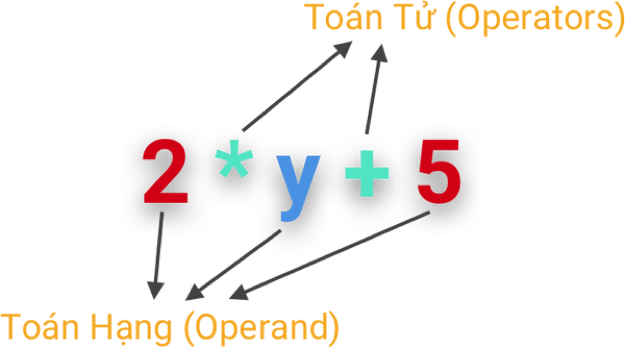

# Python Basics


[Python](https://www.python.org/) là một ngôn ngữ lập trình, được ra mắt lần đầu tiên vào năm 1991.

Như nhiều ngôn ngữ lập trình khác, Python đã phát triển theo thời gian. Phiên bản Python 3 được giới thiệu vào năm 2008. Đây là bản hiệu chỉnh lớn của ngôn ngữ lập trình Python nhưng không hoàn toàn tương thích ngược [(backward-compatible)](https://en.wikipedia.org/wiki/Backward_compatibility) với Python 2, mặc dù Python 3 đã có rất nhiều mã lệnh (code) được viết cho phiên bản Python 2. Tại INTEK, chúng tôi yêu cầu tất cả mã nguồn bạn viết PHẢI tương thích với **Python 3**.

## Giới thiệu

Bạn sẽ bắt đầu dùng Python với terminal.

Để chắc chắn rằng bạn đang dùng phiên bản **Python 3**, không phải Python 2, hãy kiểm tra phiên bản của trình thông dịch Python, tức ứng dụng chạy mã Python.

Ví dụ:

```bash
$ python --version
Python 2.7.10
$ python
Python 2.7.10 (default, Feb 22 2019, 21:55:15)
[GCC 4.2.1 Compatible Apple LLVM 10.0.1 (clang-1001.0.37.14)] on darwin
Type "help", "copyright", "credits" or "license" for more information.
>>>
```
Đây là phiên bản Python sai. Trong trường hợp này, bạn nên thử lại 1 lần nữa bằng cách chạy lệnh `python3`:

```bash
$ python3 --version
Python 3.7.3
$ python3
Python 3.7.3 (default, Mar 27 2019, 09:23:15)
[Clang 10.0.1 (clang-1001.0.46.3)] on darwin
Type "help", "copyright", "credits" or "license" for more information.
>>>
```

Tốt hơn rồi!


## Các kiểu dữ liệu nguyên thủy

[Lập trình](https://en.wikipedia.org/wiki/Computer_program), hay nói chung là [khoa học máy tính](https://en.wikipedia.org/wiki/Computer_science), là nghệ thuật xử lý và biến đổi dữ liệu.

Một dữ liệu đại diện cho một **value** (giá trị) dưới một [**type**](https://en.wikipedia.org/wiki/Data_type) (kiểu). Python hỗ trợ được nhiều [kiểu dữ liệu nguyên thủy](https://en.wikipedia.org/wiki/Primitive_data_type). Dưới đây là danh sách (chưa đầy đủ) các kiểu dữ liệu mà Python hỗ trợ:

| Kiểu dữ liệu                                                                   | Mô tả                                                                                                                    | Ví dụ                                                                                                                     |
| --------------------------------------------------------------------------- | ------------------------------------------------------------------------------------------------------------------------------ | ---------------------------------------------------------------------------------------------------------------------------- |
| [Integer](https://en.wikipedia.org/wiki/Integer) (`int`)                    | Bất kỳ số đếm nào cả số dương lẫn số âm, kể cả số không                                                                    | `0`, `1`, `3`, `-2`, `-5`, vv..                                                                                              |
| [Boolean](https://en.wikipedia.org/wiki/Boolean_data_type) (`bool`)         | Cho thấy liệu một [sự việc/đề xuất là đúng hay sai](https://www.youtube.com/watch?v=r526yum0EYQ)                            | [`True` and `False`](https://www.youtube.com/watch?v=9OK32jb_TdI)                                                            |
| [Float](https://en.wikipedia.org/wiki/Floating-point_arithmetic) (`float`)  | Bất kỳ số thực nào                                                                                                               | `3.1415`, `-1.4142135623730951`, v.v.., và cả  `0.0`, `-1.0`, v.v.., Python xem các dữ liệu này là **floats**, không phải **integers**. |
| [String](<https://en.wikipedia.org/wiki/String_(computer_science)>) (`str`) | Bất kỳ [chuỗi nào của 0 hoặc nhiều ký tự hơn](https://www.youtube.com/watch?v=iAzShkKzpJo), được xác định giữa hai dấu ngoặc đơn hoặc ngoặc kép | "Hello, world!, 'How are you doing?', "What's your name?", '"Sa mưa giông" tiếng Anh là gì?', "", vv..                      |

Trong Python, có  một giá trị đặc biệt: `None`. Giá trị này đại diện cho … không gì cả, một nhận định rỗng, một giá trị rỗng. `None` thường được sử dụng để biểu thị sự không có giá trị. Kiểu của giá trị `None` là `NoneType`.


Để xác định [type](https://www.youtube.com/watch?v=_87ASgggEg0) (kiểu) của một giá trị cho trước, hãy dùng [hàm dựng sẵn của Python](https://docs.python.org/3/library/functions.html) [`type()`](https://docs.python.org/3/library/functions.html#type).

Ví dụ:

```python
>>> type(1)
<class 'int'>
>>> type(True)
<class 'bool'>
>>> type(2.25)
<class 'float'>
>>> type("Hello, world!")
<class 'str'>
>>> type(None)
<class 'NoneType'>
```

Để kiểm tra liệu giá trị có thuộc một kiểu cho trước hay không, hãy dùng [hàm dựng sẵn của Python](https://docs.python.org/3/library/functions.html) là [`isinstance()`](https://docs.python.org/3/library/functions.html#isinstance)

Ví dụ:

```python
>>> >>> isinstance(1, int)
True
>>> isinstance(False, bool)
True
>>> isinstance(3.1415, float)
True
>>> isinstance(1.0, int)
False
>>> isinstance("Good Morning, Viêt Nam!", str)
True
>>> isinstance("1", int)
False
```
Tuy nhiên, `None` là trường hợp đặc biệt; Python không hiển thị kiểu [`NoneType`](https://docs.python.org/3/c-api/none.html)

```python
>>> isinstance(None, NoneType)
Traceback (most recent call last):
  File "<stdin>", line 1, in <module>
NameError: name 'NoneType' is not defined
```

Bạn phải kiểm tra theo cách khác:

```python
>>> isinstance(None, type(None))
True
```

## Các operator (toán tử) số học và biểu thức

[Arithmetic](https://en.wikipedia.org/wiki/Arithmetic) [expressions](<https://en.wikipedia.org/wiki/Expression_(mathematics)>) (biểu thức số học) gồm các arithmetic terms (số hạng số học) được liên kết với nhau bằng phép toán số học.



Các phép toán số học cơ bản là cộng, trừ, nhân và chia.

| operator (toán tử) | Tên           | Ý nghĩa                                                                           |
| -------- | -------------- | --------------------------------------------------------------------------------- |
| `+`      | Phép cộng       | Thêm hai operand (toán hạng) hoặc operator (toán tử) “cộng” đơn                                                   |
| `–`      | Phép trừ    | Trừ operand (toán hạng) bên phải vào operand (toán hạng) bên trái                                             |
| `*`      | Phép nhân | Nhân hai operand (toán hạng)                                                           |
| `/`      | Phép chia       | Chia operand (toán hạng) bên trái cho operand (toán hạng) bên phải                                             |
| `%`      | Lấy phần dư        | Lấy số dư                                                               |
| `//`     | Chia lấy nguyên | Phép chia mà kết quả là giữ lại số nguyên và bỏ đi các con số sau dấu thập phân |
| `**`     | Lũy thừa | Toán hạng bên trái được tăng lên với số lần của toán hạng bên phải                                         |

Ví dụ:

```python
>>> 1 + 2
3
>>> 3 - 2
1
>>> 2 * 3
6
>>> 4 / 2
2
>>> 5 % 3
2
>>> 4 // 3
1
>> 2 ** 8
256
```

### Số nguyên: Kết quả kiểu dữ liệu với operator (toán tử) phép chia

Kiểu dữ liệu kết quả của biểu thức số học có thể không cùng với kiểu dữ liệu của mỗi [operand](https://en.wikipedia.org/wiki/Operand) (toán hạng).

Ví dụ:

```python
>>> 1 / 2
0.5
>>> type(1)
<class 'int'>
>>> type(2)
<class 'int'>
>>> type(1 / 2)
<class 'float'>
```

Đây là kết quả toán học được mong đợi.

Tuy nhiên:

```python
>>> 4 / 2
2.0
>>> 1 / 1
1.0
>>> (2 / 1) + 1
3.0
```

Python luôn cho ra kết quả là một số thực khi biểu thức số học có operator (toán tử) “phép chia”.

### Số thực dấu phẩy động: Một số vấn đề và hạn chế

Kết quả của một biểu thức số học với operator (toán tử) dấu phẩy động có thể là  [xấp xỉ](https://docs.python.org/3/tutorial/floatingpoint.html):

```python
>>> 0.2 - 0.1
0.1
>>> 0.3 - 0.1
0.19999999999999998
```

### Kết hợp giữa các operands (toán hạng) số nguyên và số thực

Với biểu thức số học vừa có số nguyên vừa có số thực, Python luôn cho ra kết quả là số thực.

Ví dụ:

```python
>>> 1 * 2.1
2.1
>>> 3.0 * 2
6.0
>>> 6.0 / 3.0
2.0
>>> (2 - 1.0) * 5
5.0
>>> 2.3 // 2
1.0
```

## Tổng quan về operators (toán tử) và expressions (biểu thức) trong Python

Toán tử đi cùng với toán hạng của các kiểu tương thích.

Bạn có thể viết các biểu thức gồm số nguyên và số thực được kết hợp với các operators (toán tử) số học. Đây là những biểu thức **arithmetic** (số học) cổ điển.

Tuy nhiên, trong Python, các operators (toán tử) cộng (`+`),  trừ (`-`), nhân (`*`), chia (`/`), modulo (chia lấy phần dư) (`%`), chia lấy phần nguyên (`//`), lũy thừa (`**`), có thể chấp nhận các toán hạng khác ngoài số nguyên và số thực. Tính chất của phép tính hoàn toàn phụ thuộc vào sự kết hợp của các kiểu toán hạng. Một vài kiểu kết hợp được cho phép, trong khi  một vài kiểu khác thì không.

| Operator (Toán tử) | Left Operand (Toán hạng bên trái)                       | Right Operand (Toán hạng bên phải)                     | Ý nghĩa                                                                                                                                                                  |
| -------- | ---------------------------------- | ---------------------------------- | ------------------------------------------------------------------------------------------------------------------------------------------------------------------------ |
| `+`      | String (`str`)                     | String (`str`)                     | Trả về ghép nối toán hạng bên phải (chuỗi) vào cuối toán hạng bên trái (chuỗi)                                                                                             |
| `*`      | String (`str`)                     | Integer (`int`)                    | Trả về chuỗi mà toán hạng bên phải lặp lại đúng số lần được chỉ định bởi số nguyên (toán hạng bên trái)                                                                                           |
| `*`      | Integer (`int`)                    | String (`str`)                     | Kết quả như trên                                                                                                                                                   |
| any      | Boolean (`bool`)                   | Integer (`int`) or Float (`float`) | Cho ra kết quả của biểu thức số học trong đó `True` ban đầu được chuyển đổi thành số nguyên `1`, và `False` ban đầu được chuyển đổi thành số nguyên `0` |
| any      | Integer (`int`) or Float (`float`) | Boolean (`bool`)                   | Kết quả như trên                                                                                                                                                   |
| any      | Boolean (`bool`)                   | Boolean (`bool`)                   | Kết quả như trên                                                                                                                                                   |

Ví dụ:

```python
>>> "Bonjour " + "Viêt-nam !"
'Bonjour Viêt-nam !'
>>> 'a' * 10
'aaaaaaaaaa'
>>> True + 1
2
>>> True - 1
0
>>> True * 4 / 2
2.0
>>> False + 2.1
2.1
>>> 1 - 4 * False
1
>>> 1 / False
Traceback (most recent call last):
  File "<stdin>", line 1, in <module>
ZeroDivisionError: division by zero
>>> True + False
1
```

Không có biểu thức kết hợp toán hạng string (chuỗi) và toán hạng kiểu khác.

Ví dụ:

```python
>>> '1' + 2
Traceback (most recent call last):
  File "<stdin>", line 1, in <module>
TypeError: can only concatenate str (not "int") to str
>>> '1' * '2'
Traceback (most recent call last):
  File "<stdin>", line 1, in <module>
TypeError: can't multiply sequence by non-int of type 'str'
```

Nếu bạn muốn viết biểu thức kết hợp các toán hạng có kiểu không tương thích, bạn cần [cast](https://en.wikipedia.org/wiki/Type_conversion) (chuyển đổi) một trong số các toán hạng đó với các hàm dựng sẵn như [`int()`](https://docs.python.org/3/library/functions.html#int), [`bool()`](https://docs.python.org/3/library/functions.html#bool), [`float()`](https://docs.python.org/3/library/functions.html#float), [`str()`](https://docs.python.org/3/library/functions.html#func-str).

Ví dụ:

```python
>>> '1' + str(2)
'12'
>>> str(True) + str(False)
'TrueFalse'
>>> int('1') + 2
3
>>> int('1') / float('2')
2.0
>>> bool(2)
True
>>> bool(0)
False
>>> bool('foo')
True
>>> bool('')
False
```

## Các operators (toán tử) so sánh 

Python hỗ trợ nhiều operators (toán tử) so sánh giá trị các toán hạng ở cả hai vế của chúng và trả về giá trị `True` hoặc `False` tùy điều kiện.


| Operator (toán tử) | Mô tả                                                                                                      | Ví dụ  |
| -------- | ---------------------------------------------------------------------------------------------------------------- | -------- |
| `==`     | Nếu giá trị của hai toán hạng bằng nhau, kết quả điều kiện là true (đúng)                                         | `a == b` |
| `!=`     | Nếu giá trị của hai toán hạng không bằng nhau, kết quả điều kiện là true (đúng)                                             | `a != b` |
| `>`      | Nếu giá trị của toán hạng bên trái lớn hơn giá trị của toán hạng bên phải, kết quả điều kiện là true (đúng)             | `a > b`  |
| `<`      | Nếu giá trị của toán hạng bên trái nhỏ hơn giá trị của toán hạng bên phải, kết quả điều kiện là true (đúng)                | `a < b`  |
| `>=`     | Nếu giá trị của toán hạng bên trái lớn hơn hoặc bằng giá trị của toán hạng bên phải, kết quả điều kiện là true (đúng) | `a >= b` |
| `<=`     | Nếu giá trị của toán hạng bên trái nhỏ hơn hoặc bằng giá trị của toán hạng bên phải, kết quả điều kiện là true (đúng)    | `a <= b` |

Ví dụ:

```python
>>> 1 == 0
False
>>> 1 != 0
True
>>> 1 > 0
True
>>> 1 < 0
False
>>> 1 => 2
False
>>> 2 >= 2
True
```

## Các operators (toán tử) logic

Python hỗ trợ 3 operators (toán tử) logic mà kết quả chúng trả về là `True` hoặc `False` tùy điều kiện. Những operators này là phép hội mà bạn có thể dùng để kết hợp nhiều hơn một điều kiện.

| Operator | Mô tả                                                         | Ví dụ   |
| -------- | ------------------------------------------------------------------- | --------- |
| `and`    | Nếu cả hai toán hạng/ điều kiện là đúng, kết quả là true (đúng)           | `a and b` |
| `or`     | Nếu một trong hai toán hạng/ điều kiện là đúng, kết quả là true (đúng)  |`a or b`
| `not`    | Được dùng để đảo ngược trạng thái logic của toán hạng                    | `not a`   |

```python
>>> True and False
False
>>> True or False
True
>>> not True
False
>>> not False
True
>>> (0 > 1) or (1 < 2)
True
>>> (0 == 0) and (1 <= 0)
False
>>> not((1 > 0) or (2 < 1))
False
```

## Variables (Biến)

Hiểu một cách đơn giản, một [variable](<https://en.wikipedia.org/wiki/Variable_(computer_science)>) (biến) có thể so sánh với một cái hộp, được xác định bằng một tên gọi, mà trong đó chứa một dữ liệu (chẳng hạn **value** (giá trị) của một **type** (kiểu) nào đó).

### Variable name (Tên biến)

Variable name (tên biến) trong Python có độ dài bất kỳ, có thể bao gồm các chữ cái hoa và thường (`A-Z`, `a-z`), số (`0-9`) và ký tự được gạch chân (`_`). Tuy nhiên, điểm hạn chế là dù tên biến có thể bao gồm chữ số nhưng ký tự đầu tiên của tên biến không được là số.

Ví dụ:

- `i`
- `foo`
- `my_variable`
- `wh4t3v3R_n4m3_y0u_th1nk_us3ful`

_Lưu ý: Tên bạn đặt cho variable phải có nghĩa, tức là tên gọi phải cho biết nội dung của biến_

3 ví dụ dưới đây là 3 phương pháp phổ biến nhất dùng để tạo 1 tên biến bao gồm nhiều từ:

| Tên gọi                                                   | Mô tả                                                                        | Ví dụ                       |
| ------------------------------------------------------ | ---------------------------------------------------------------------------------- | ----------------------------- |
| [Camel Case](https://en.wikipedia.org/wiki/Camel_case) | Từ ở vị trí thứ hai trở về sau được viết hoa chữ cái đầu, để dễ dàng phân biệt các từ hơn | `numberOfCollegeGraduates`    |
| [Pascal Case](http://wiki.c2.com/?PascalCase)          | Giống Camel Case, tuy nhiên từ đầu tiên cũng được viết hoa chữ cái đầu                 | `NumberOfCollegeGraduates`    |
| [Snake Case](https://en.wikipedia.org/wiki/Snake_case) | Các từ được phân cách bằng dấu gạch chân                                                 | `number_of_college_graduates` |


[Hướng dẫn về kiểu cho Python](https://www.python.org/dev/peps/pep-0008/), còn được biết với tên gọi PEP 8, bao gồm các [quy tắc đặt tên](<https://en.wikipedia.org/wiki/Naming_convention_(programming)>) trong đó gợi ý về các tiêu chuẩn đặt tên cho nhiều kiểu đối tượng khác nhau.

PEP 8 [khuyến nghị](https://www.python.org/dev/peps/pep-0008/#naming-conventions) sử dụng **Snake Case** cho tên biến.

PEP 8 cũng khuyến nghị đối với tên [constants](https://www.python.org/dev/peps/pep-0008/#constants) (hằng) thì viết hoa hết các từ với dấu gạch chân. Ví dụ, `MAX_OVERFLOW` và `TOTAL`.


_Lưu ý: Trong Python, một hằng chỉ là một variable (biến) như tất cả variables (biến) khác. Một hằng chỉ là một variable (biến) được đặt tên với quy tắc `UPPER_CASE_NAME` (`TÊN_VIẾT_HOA`) mà developer nào cũng hiểu đó là một variable (biến) không thay đổi. Thực tế, bạn vẫn có thể thay đổi giá trị của một variable (biến) “constant” và bất kỳ developer nào đang dùng code của bạn cũng sẽ **ghét** bạn…_

### Variable Names (Tên biến) vs. Reserved keywords (Từ khóa dành riêng)

Bạn không thể đặt variable names (tên biến) trùng với [reserved keywords](https://docs.python.org/3/reference/lexical_analysis.html#keywords) (từ khóa dành riêng) của Python.

Bạn KHÔNG NÊN đặt tên biến trùng với tên các Python built-in [functions](https://docs.python.org/3/library/functions.html#built-in-funcs) (hàm dựng sẵn của Python) vì bạn sẽ không sử dụng được các hàm này nữa.

### Variable Data Type (Các kiểu dữ liệu biến)

Trở lại ví dụ một biến có thể được xem là một cái hộp.
Nếu một hộp chứa giá trị `None` thì hộp đó là rỗng.

Khi một hộp không tồn tại, chẳng hạn như khi bạn tham chiếu tới một hộp với tên gọi chưa được xác định, hộp đó được gọi là [**undefined**](https://en.wikipedia.org/wiki/Undefined_variable) (chưa xác định).

_Lưu ý: một vài ngôn ngữ lập trình khác dùng thuật ngữ **undeclared** (chưa khai báo) để chỉ ra một variable (biến) chưa được tạo (tức chưa được khai báo) và thuật ngữ **undefined** (chưa xác định) để chỉ ra một variable (biến) chưa được gán bất kỳ giá trị nào nhưng đã được khai báo trong chương trình._

### Phép gán variable (biến): Kê khai variable (biến)

Phép toán giúp đặt dữ liệu vào hộp gọi là **assignment** (phép gán). Một phép gán được thực hiện với operator (toán tử) `=`.

Ví dụ:

```python
>>> a = 0
>>> b = True
>>> c = 1.3
>>> d = "Hello, Việt Nam"
>>> e = None
```

Trong Python, bạn đang khai báo (hay tạo) một variable lần đầu tiên khi bạn gán dữ liệu cho variable đó. Tất cả phép tính được thực hiện cùng một lúc: khai báo/đặt tên và gán. Bạn không thể khai báo một variable  mà không gán dữ liệu cho variable đó.

Một variable được gọi là rỗng khi variable đó chứa giá trị `None`.

Một variable chỉ có thể chứa một dữ liệu trong một thời gian nhất định.

_Lưu ý: Một người không chuyên sẽ nói rằng một variable có thể chứa nhiều dữ liệu, ví dụ một [`list`](https://docs.python.org/3/library/stdtypes.html?#lists) (danh sách)… Một `list` (danh sách) có thể chứa nhiều dữ liệu. Nhưng khi bạn gán một `list` cho một biến, nghĩa là bạn đã gán một dữ liệu (chính bản thân đối tượng `list`) cho biến đó, bất kể số lượng các yếu tố (dữ liệu) mà `list` này có thể chứa là bao nhiêu_

### Variable Assignment (gán biến): _Syntactic Sugar_ Operators (các cú pháp đặc biệt)

Các operators (toán tử) của phép gán được dùng để gán dữ liệu cho variable (biến).

Bạn đã biết về toán tử =, vốn được dùng để tạo một biến và gán giá trị lần đầu tiên cho biến đó.

Ngoài ra, còn có một số operators gán (toán tử gán) khác, tương đương với toán tử `=`, giúp đơn giản hóa biểu thức và làm cho biểu thức dễ đọc hơn. Chúng ta gọi những toán tử đó là [cú pháp đặc biệt](https://en.wikipedia.org/wiki/Syntactic_sugar).


| Operator  | Ví dụ   | Tương đương với |
| -------- | --------- | ------------- |
| `+=`     | `x += 5`  | `x = x + 5`   |
| `-=`     | `x -= 5`  | `x = x - 5`   |
| `*=`     | `x *= 5`  | `x = x * 5`   |
| `/=`     | `x /= 5`  | `x = x / 5`   |
| `%=`     | `x %= 5`  | `x = x % 5`   |
| `//=`    | `x //= 5` | `x = x // 5`  |
| `**=`    | `x **= 5` | `x = x ** 5`  |
| `&=`     | `x &= 5`  | `x = x & 5`   |
| `|=`     | `x |= 5`  | `x = x | 5`   |
| `^=`     | `x ^= 5`  | `x = x ^ 5`   |
| `>>`     | `x >>= 5` | `x = x >> 5`  |
| `>>`     | `x <<= 5` | `x = x << 5`  |

### Phép gán biến: Ngôn ngữ kiểu động

Bạn có thể gán cho một biến một dữ liệu thuộc bất kỳ kiểu nào.

_Lưu ý: Python là một [dynamically-typed language](https://en.wikipedia.org/wiki/Dynamic_programming_language) (ngôn ngữ kiểu động). Một biến không bị hạn chế ở một kiểu dữ liệu cụ thể. Bạn có thể khai báo biến mà không cần chỉ rõ bất kỳ kiểu dữ liệu nào. Ngược lại, [Java](<https://en.wikipedia.org/wiki/Java_(programming*language)>) là một [statically-typed language](https://android.jlelse.eu/magic-lies-here-statically-typed-vs-dynamically-typed-languages-d151c7f95e2b) (ngôn ngữ tĩnh): khi bạn khai báo một biến, bạn phải chỉ rõ kiểu dữ liệu của giá trị mà biến có thể có và bị giới hạn ở đó.*_

### Phép gán biến: Gán nhiều lần liên tiếp

Bạn có thể gán lại một biến nhiều lần khác nhau theo thời gian.

Ví dụ:

```python
>>> a = 0
>>> a = True
>>> a = 1.3
>>> a = "Hello, Việt Nam"
>>> a = None
```

Khi bạn gán một giá trị mới cho một biến, giá trị đã được gán trước đó cho biến sẽ tự động bị loại bỏ hoặc đúng hơn là bị xóa.

### Biểu thức với biến

Biểu thức dùng cho biến cũng giống với biểu thức dùng cho giá trị của các kiểu dữ liệu nguyên thủy, như integers, booleans, real numbers và strings. Python lấy giá trị của từng biến được sử dụng trong biểu thức và thực hiện biểu thức với các giá trị đó.

Ví dụ:

```python
>>> 1
1
>>> a = 2
>>> a
2
>>> b = 3
>>> 1 + a + b
6
>>> c = 1 * b / a
>>> c
1.5
```

## Cơ bản về Cấu trúc dữ liệu

Các kiểu dữ liệu nguyên thủy không đủ để viết những phần mềm phức tạp. Các phần mềm phức tạp phải thao tác trên rất nhiều dữ liệu. Vì vậy, ta cần phân chia các dữ liệu theo nhóm để dễ dàng xử lý.

Python cung cấp nhiều kiểu dữ liệu giúp ta dễ dàng nhóm các dữ liệu với nhau:

| Tên gọi                                                                             | Mô tả                                                                                                                                                                                                                                                                                                     | Ví dụ                                                 |
| --------------------------------------------------------------------------------- | --------------------------------------------------------------------------------------------------------------------------------------------------------------------------------------------------------------------------------------------------------------------------------------------------------------- | -------------------------------------------------------- |
| [list](https://docs.python.org/3/library/stdtypes.html#lists)                     | Là một [collection (tập hợp)](https://www.youtube.com/watch?v=tw7ror9x32s) các elements (yếu tố) không theo thứ tự và mutable (có thể thay đổi, ngược lại với [immutable - không thể thay đổi](https://en.wikipedia.org/wiki/Immutable_object)), các yếu tố có thể trùng lặp                                                                                                                                                                                    | `[2, 2, True, 0.65, "Hello!"]`                    |
| [tuple](https://docs.python.org/3/library/stdtypes.html#tuples)                   | Là một collection (tập hợp) các yếu tố không theo thứ tự và [immutable (không thể thay đổi)](https://en.wikipedia.org/wiki/Immutable_object), các yếu tố có thể trùng lặp                                                                                                                                                                                    | `(False, 1, "Việt Nam", 3.14, False)`                    |
| [set](https://docs.python.org/3/library/stdtypes.html#set-types-set-frozenset)    | Là một [collection](https://www.youtube.com/watch?v=2u_ZExcNBzA) (tập hợp) các yếu tố không theo thứ tự và không có yếu tố trùng lặp                                                                                                                                                                                                                  | `{1, 2, 3}`                                                |
| [dictionary](https://docs.python.org/3/tutorial/datastructures.html#dictionaries) | Là một collection (tập hợp) các cặp [key/value](https://en.wikipedia.org/wiki/Attribute%E2%80%93value_pair) (khóa/giá trị) không theo thứ tự (ví dụ: [associative array](https://en.wikipedia.org/wiki/Associative_array)); trong [dictionary](https://www.youtube.com/watch?v=ZEZdys-fHDw), mỗi key là duy nhất, mặc dù các yếu tố có thể trùng lặp | `{1: 2.5, 'username': 'lythanhphu', 'is_student': True}` |

Vài ví dụ thông dụng về những cấu trúc dữ liệu trên:

```python
# List examples:
>>> my_list = [1, 2, 3]
>>> my_list[0]
1
>>> my_list[1] = 4
>>> my_list
[1, 4, 3]
>>> my_list.append(2)
>>> my_list
[1, 4, 3, 2]

# Tuple examples:
>>> my_tuple = (1, 2, 3)
>>> my_tuple[1]
2
>>> my_tuple[0] = 4
Traceback (most recent call last):
  File "<stdin>", line 1, in <module>
TypeError: 'tuple' object does not support item assignment

# Set examples:
>>> my_set = {1, 2, 3}
>>> my_set.add(4)
>>> my_set
{1, 2, 3, 4}
>>> my_set.add(2)
>>> my_set
{1, 2, 3, 4}
>>> my_set[2]
Traceback (most recent call last):
  File "<stdin>", line 1, in <module>
TypeError: 'set' object is not subscriptable

# Dictionary examples:
>>> my_dictionary = {'username': 'lythanhphu', 'is_student': True}
>>> my_dictionary['username']
'lythanhphu'
>>> my_dictionary['is_student'] = False
>>> my_dictionary
{'username': 'lythanhphu', 'is_student': False}
>>> my_dictionary['fullname']
Traceback (most recent call last):
  File "<stdin>", line 1, in <module>
KeyError: 'fullname'
```

Bạn có thể tìm thấy rất nhiều video hướng dẫn trên Internet giải thích cách [lists](https://www.youtube.com/watch?v=ohCDWZgNIU0), [tuple](https://www.youtube.com/watch?v=NI26dqhs2Rk), [set](https://www.youtube.com/watch?v=sBvaPopWOmQ) và [dictionaries](https://www.youtube.com/watch?v=XCcpzWs-CI4) hoạt động và nhiều video khác cụ thể hơn giải thích làm thế nào để [slice list](https://www.youtube.com/watch?v=ajrtAuDg3yw) (cắt danh sách) và các chuỗi trong Python để trích ra một vài yếu tố cụ thể.

## Built-In Functions (Các hàm dựng sẵn)

Python hỗ trợ nhiều [built-in functions](https://docs.python.org/3/library/functions.html) (hàm dựng sẵn)

Hàm dựng sẵn đầu tiên mà bạn cần biết là hàm [`help()`](https://docs.python.org/3/library/functions.html#help) cho phép [displays the documentation](https://www.youtube.com/watch?v=BVXv0-1Rcc8) (hiển thị thông tin) về một hàm cụ thể

Ví dụ:

```python
>>> help(abs)
Help on built-in function abs in module builtins:

abs(x, /)
    Return the absolute value of the argument.
```

_Lưu ý: Đánh phím `q` để thoát khỏi tương tác trợ giúp._

Chúng tôi đặc biệt khuyến khích các bạn làm quen với các hàm khác dưới đây. Có thể bạn đã biết vài hàm trong số đó

|                                                                    |                                                                       |                                                                     |                                                                     |
| ------------------------------------------------------------------ | --------------------------------------------------------------------- | ------------------------------------------------------------------- | ------------------------------------------------------------------- |
| [`abs()`](https://docs.python.org/3/library/functions.html#abs)    | [`bool()`](https://docs.python.org/3/library/functions.html#bool)     | [`chr()`](https://docs.python.org/3/library/functions.html#chr)     | [`dict()`](https://docs.python.org/3/library/stdtypes.html#dict)    |
| [`hex()`](https://docs.python.org/3/library/functions.html#hex)    | [`float()`](https://docs.python.org/3/library/functions.html#float)   | [`input()`](https://docs.python.org/3/library/functions.html#input) | [`int()`](https://docs.python.org/3/library/functions.html#int)     |
| [`len()`](https://docs.python.org/3/library/functions.html#len)    | [`list()`](https://docs.python.org/3/library/stdtypes.html#list)      | [`max()`](https://docs.python.org/3/library/functions.html#max)     | [`min()`](https://docs.python.org/3/library/functions.html#min)     |
| [`ord()`](https://docs.python.org/3/library/functions.html#ord)    | [`pow()`](https://docs.python.org/3/library/functions.html#pow)       | [`print()`](https://docs.python.org/3/library/functions.html#print) | [`round()`](https://docs.python.org/3/library/functions.html#round) |
| [`set()`](https://docs.python.org/3/library/stdtypes.html#set)     | [`sorted()`](https://docs.python.org/3/library/functions.html#sorted) | [`str()`](https://docs.python.org/3/library/stdtypes.html#str)      | [`sum()`](https://docs.python.org/3/library/functions.html#sum)     |
| [`tuple()`](https://docs.python.org/3/library/stdtypes.html#tuple) | [`type()`](https://docs.python.org/3/library/functions.html#type)     |

Ví dụ:

```python
>>> abs(-1)
1
>>> bool('True')
True
>>> chr(65)
'A'
>>>  dict([('username', 'lythanhphu')])
{'username': 'lythanhphu'}
>>> hex(15)
>>> float('1.5')
1.5
>>> username = input("What is your name: ")
What is your name: LÝ Thanh Phú
>>> username
'LÝ Thanh Phú'
>>> int('1984')
1984
>>> len('LÝ Thanh Phú')
12
>>> list()
[]
>>> max(1, 2, 3)
3
>>> max([1, 3, 2])
3
>>> min(1, 2, 3)
1
>>> ord('A')
65
>>> pow(2, 3)
8
>>> print(username)
'LÝ Thanh Phú'
>>> round(1.789)
2
>>> round(1.789, 2)
1.79
>>> set([1, 2, 2, 3, 1])
{1, 2, 3}
>>> sorted([1, 3, 5, 2])
[1, 2, 3, 5]
>>> sorted(["Xuân Anh", "Minh Anh", "Kim Anh"])
['Kim Anh', 'Minh Anh', 'Xuân Anh']
>>> str(170)
'170'
>>> sum([1, 2, 3])
6
>>> tuple([1, 2, 3])
(1, 2, 3)
>>> type('Python')
<class 'str'>
```

## Các câu lệnh có điều kiện

[Conditional statements](https://realpython.com/python-conditional-statements/) (Các câu lệnh có điều kiện) cho phép nhà phát triển phần mềm [control the flow](https://en.wikipedia.org/wiki/Control_flow) (kiểm soát lưu lượng) chương trình của họ tùy vào các [conditions](https://www.youtube.com/watch?v=f4KOjWS_KZs) (điều kiện)

[Ví dụ:](https://www.youtube.com/watch?v=AWek49wXGzI)

```python
>>> age = int(input("How old are you? "))
>>> if age <= 10:
...     print("You are a kid.")
... elif age <= 12:
...     print("You are a tween.")
... elif age < 20:
...     print("You are a teenager.")
... else:
...     print("You are an adult.")
```

## Câu lệnh kiểm soát vòng lặp

Trong Python, [loops statements](https://python-textbok.readthedocs.io/en/1.0/Loop_Control_Statements.html) (các câu lệnh vòng lặp) cho phép bạn thực hiện một khối mã lệnh (ví dụ: một nhóm các câu lệnh) lặp đi lặp lại chừng nào vẫn thỏa mãn một vài tiêu chí nào đó.

Có hai [loop statements](https://www.youtube.com/watch?v=94UHCEmprCY) (câu lệnh vòng lặp) trong Python: `for` và `while`.

### Dòng lệnh `while`

[`while` statement](https://www.youtube.com/watch?v=6TEGxJXLAWQ) (dòng lệnh while) giữ một vài phép tính lặp đi lặp lại chừng nào điều kiện vẫn đúng.

 Bây giờ, bạn hãy yêu cầu người sử dụng gõ tên đăng nhập và kiểm tra xem  tên đăng nhập được nhập vào chỉ bao gồm các chữ cái in thường `[a-z]` hay không.

Trong ví dụ đầu tiên, người sử dụng nhập vào “lythanhphu”:

```python
>>> username = input("Enter your username? ")
Enter your username? lythanhphu
>>> i = 0
>>> while i < len(username):
...     c = username[i]
...     if c < 'a' or c > 'z':
...         print("Your username doesn't comply with our requirements!")
...         break
...     i += 1
...
```

Không vấn đề gì!

Trong ví dụ thứ hai, người sử dụng nhập vào “n00b”:

```python
>>> username = input("Enter your username? ")
Enter your username? n00b
>>> i = 0
>>> while i < len(username):
...     c = username[i]
...     if c < 'a' or c > 'z':
...         print("Your username doesn't comply with our requirements!")
...         break
...     i += 1
...
Your username doesn't comply with our requirements!
```

### Dòng lệnh `for`

[`for` statement](https://www.youtube.com/watch?v=OnDr4J2UXSA) (dòng lệnh `for`) lặp lại nhiều lần cho một vài bước đã định trước.

Bạn nên dùng lệnh `while` khi bạn không biết trước cần thực hiện nội dung vòng lặp bao nhiêu lần. Ví dụ trước đã dùng sai dòng lệnh `while`, trong khi đáng lẽ nên dùng [`for` statement](https://www.youtube.com/watch?v=iVyWLmQ0QYA) như dưới đây:

```python
>>> username = input("Enter your username? ")
Enter your username? lythanhphu
>>> for i in range(len(username)):
...     c = username[i]
...     if c < 'a' or c > 'z':
...         print("Your username doesn't comply with our requirements!")
...         break
...     i += 1
...
```

### Kiểm soát vòng lặp

Đôi khi, bạn có thể muốn [hoàn toàn thoát khỏi vòng lặp hoặc bỏ qua](https://www.youtube.com/watch?v=yCZBnjF4_tU) một phần nào đó của vòng lặp khi nó đáp ứng một điều kiện cụ thể. Điều này có thể được thực hiện bằng cách sử dụng [loop control statements](https://www.digitalocean.com/community/tutorials/how-to-use-break-continue-and-pass-statements-when-working-with-loops-in-python-3) (câu lệnh kiểm soát vòng lặp).


## List Comprehensions

[List comprehension](https://docs.python.org/3/tutorial/datastructures.html#list-comprehensions) là một cú pháp xây dựng giúp tạo ra danh sách mới dựa trên các [danh sách đã có](https://www.youtube.com/watch?v=5K08WcjGV6c).

[List comprehensions](https://www.youtube.com/watch?v=AhSvKGTh28Q) sẽ [hiệu quả hơn](https://towardsdatascience.com/python-basics-list-comprehensions-631278f22c40) cả về mặt tính toán lẫn về mặt không gian và thời gian viết mã lệnh so với một vòng lặp `for`:

```python
>>> numbers = [1, 2, 3, 4, 5]
>>> squares = []
>>> for number in numbers:
...     if number > 2:
...         squares.append(number**2)
...
>>> print(squares)
[9, 16, 25]
```

So với:

```python
>>> numbers = [1, 2, 3, 4, 5]
>>> squares = [number**2 for number in numbers if number > 2]
>>> print(squares)
[9, 16, 25]
```

## File Input/Output (I/O)

Bạn đã học khái niệm tập tin/thư mục và đường dẫn trong nhiệm vụ _Unix Shell Basics_. Đã đến lúc sử dụng những khái niệm này trong Python.

Một [file operation](https://realpython.com/read-write-files-python/) (thao tác tập tin) được thực hiện theo thứ tự sau.

- [Open](https://docs.python.org/3/library/functions.html#open) (Mở) một tập tin
- Đọc hoặc viết
- Đóng tập tin

https://www.programiz.com/python-programming/file-operation

Có hai loại tập tin: tập tin văn bản và tập tin nhị phân. Chúng ta sẽ chủ yếu tập trung vào [text files](https://www.youtube.com/watch?v=4mX0uPQFLDU) (tập tin văn bản).

Khi chúng ta xử lý các tập tin và thư mục, phần lớn thời gian là xử lý với đường dẫn. Python cung cấp [`os` module](https://docs.python.org/3/library/os.html) (mô đun `os`), module này cung cấp các hàm để tương tác với hệ điều hành; và module [`os.path`](https://docs.python.org/3/library/os.path.html#module-os.path), module này cung cấp các hàm để [xử lý đường dẫn](https://www.youtube.com/watch?v=4mX0uPQFLDU).

_Lưu ý: Có thể bạn vẫn chưa quen với các modules của Python. Chúng tôi sẽ giới thiệu các modules này ở phần dưới._

## Functions (hàm)

Một [**function**](https://www.youtube.com/watch?v=NSbOtYzIQI0) (hàm) là một khối mã lệnh, có thể tái sử dụng và được dùng để thực hiện một hành động. Hàm có tính module cao và có thể sử dụng lại nhiều lần trong một phần mềm ứng dụng.


### Function Definition (định nghĩa hàm)

Một hàm được định nghĩa với từ khóa `def` tiếp nối bằng **tên hàm (tên gọi)** và một danh sách các **tham số** nằm trong ngoặc đơn, có thể bao gồm không, một hoặc nhiều **tham số**.

Các câu lệnh tạo thành tập hợp câu lệnh của hàm bắt đầu từ dòng tiếp theo và phải lùi vào đầu dòng.

Ví dụ:

```python
>>> def a_function_that_does_nothing(a, b, c):
...     pass
```

Tên hàm của bạn phải [có nghĩa](https://dmitripavlutin.com/coding-like-shakespeare-practical-function-naming-conventions), có tính "tự giải thích".

### Function Parameters (Các tham số của hàm)

Một **parameter** (tham số) là một local **variable** (biến cục bộ) được định nghĩa cho phạm vi của một hàm và giá trị của nó được xác định bởi mã lệnh thực hiện hàm này.

Ví dụ, hãy tạo một hàm trả về [Fibonacci series](https://en.wikipedia.org/wiki/Fibonacci_number) (dãy Fibonacci) tới một giá trị cụ thể:


```python
>>> def fibonacci_series(n):
...     a, b = 0, 1
...     series = []
...     while a <= n:
...         series.append(a)
...         a, b = b, a + b
...     return series
...
```

**Function** (hàm) `fibonacci_series` được định nghĩa với một **parameter** (tham số) `n`.


### Function Call (Gọi hàm)

Mã lệnh của một function (hàm) được thực hiện khi hàm được  **called** (gọi).

Ví dụ, hàm `fibonacci_series` có thể được gọi như sau:

```python
>>> fibonacci_series(0)
[0]
>>> fibonacci_series(1)
[0, 1, 1]
>>> fibonacci_series(100)
[0, 1, 1, 2, 3, 5, 8, 13, 21, 34, 55, 89]
```

Các giá trị được truyền khi gọi hàm để đặt các tham số cho hàm đó, được gọi là **argument** (đối số).

_Lưu ý: trong lập trình máy tính, có [nhiều cách để truyền một đối số đến một hàm](https://en.wikipedia.org/wiki/Evaluation_strategy), [**pass by value** và **pass by reference**](https://www.mathwarehouse.com/programming/passing-by-value-vs-by-reference-visual-explanation.php) (**truyền theo giá trị** và **truyền theo tham chiếu**)._


Trong bài hướng dẫn này, chúng ta không [thảo luận](https://www.quora.com/Are-arguments-passed-by-value-or-by-reference-in-Python) liệu Python truyền đối số [theo giá trị hay theo tham chiếu](https://www.python-course.eu/passing_arguments.php). Chỉ cần biết rằng, khi truyền đối số tới một hàm, hàm này có thể [biến đổi các mutable objects (đối tượng có thể thay đổi)](https://docs.python.org/3/tutorial/controlflow.html#id2) đã được truyền.

Ví dụ:

```python
>>> def add_number_to_list(l, n):
...    l.append(4)
...
>>> my_list = [1, 2, 3]
>>> add_number_to_list(my_list, 4)
>>> my_list
[1, 2, 3, 4]
```

### Function Return (Kết quả trả về của hàm)

Một **function** (hàm) có thể trả về một hoặc nhiều giá trị.

Câu lệnh [`return`](https://docs.python.org/3/reference/simple_stmts.html#return) (trả về) được sử dụng để định nghĩa giá trị trả về khi hàm được gọi.

Ví dụ:

```python
>>> def reverse_value(a, b)
>>> ... return b, a
>>> ...
>>> reverse_value(1, 2)
(2, 1)
>>> i, j = reverse_value(0, 1)
>>> j
0
```

Trong lập trình máy tính, một **function** (hàm) mà không trả về một giá trị được gọi là một **procedure** (thủ tục). Trong Python, chỉ có **function** (hàm). Thậm chí các hàm không có câu lệnh `return` vẫn trả về một giá trị: giá trị `None`.

Ví dụ:

```python
>>> def function_that_does_not_explicitly_return_anything():
...     pass
...
>>> foo = function_that_does_not_explicitly_return_anything()
>>> type(foo)
<type 'NoneType'>
>>> foo is None
True
```

### Function Documentation (Tư liệu về hàm)

Trong lập trình phần mềm, [tư liệu của mã lệnh](https://realpython.com/documenting-python-code/) quan trọng hơn bản thân mã lệnh đó.

Python, cũng như các ngôn ngữ lập trình khác, xác định quy tắc để lập tư liệu cho hàm bằng cách sử dụng [docstrings](https://docs.python.org/3/tutorial/controlflow.html#tut-docstrings) ([PEP-257](https://www.python.org/dev/peps/pep-0257/)).

Tuy nhiên, Python không buộc bạn phải sử dụng một dạng `dosctring` đặc biệt. Python cho phép vài dạng `dosctring` khác nhau. Dưới đây là một vài dạng phổ biến:

| Kiểu định dạng                                                                                               | Mô tả                                                                    | Đặc tả hình thức? |
| ------------------------------------------------------------------------------------------------------------- | ------------------------------------------------------------------------------ | --------------------- |
| [Google docstrings](https://github.com/google/styleguide/blob/gh-pages/pyguide.md#38-comments-and-docstrings) | Định dạng được khuyến nghị của Google                                     | Không                    |
| [reStructured Text](http://docutils.sourceforge.net/rst.html)                                                 | Chuẩn tư liệu Python chính thức; không thân thiện với người mới nhập môn nhưng có nhiều tính năng | Có                   |
| [NumPy/SciPy docstrings](https://numpydoc.readthedocs.io/en/latest/format.html)                               | NumPy là sự kết hợp giữa reStructured và Google docstrings                       | Có                   |
| [Epytext](http://epydoc.sourceforge.net/epytext.html)                                                         | Một bản chuyển thể Python của Epydoc; rất phù hợp cho các developers đã quen với Java                       | Có                   |

Việc lựa chọn định dạng docstring tùy thuộc vào bạn, nhưng bạn nên giữ nguyên một định dạng trong suốt dự án.

Ví dụ, nếu sử dụng định dạng [`epytext` format](http://epydoc.sourceforge.net/manual-fields.html), chúng ta có thể lập tư  liệu cho hàm `fibonacci_series` như sau:

```python
def fibonacci_series(n):
    """Return the Fibonacci series up to the number `n`.

    @param n: An integer.

    @return: A list of integers following the Fibonacci series up to the
        number `n`.
    """
    a, b = 0, 1
    series = []
    while a <= n:
        series.append(a)
        a, b = b, a + b
    return series
```
Khi bạn viết một tư liệu dài về hàm, bạn nên giới hạn khối văn bản (hay “đoạn”) theo [chiều dài dòng](https://en.wikipedia.org/wiki/Line_length) tối đa. [Một dòng với 66 ký tự](http://webtypography.net/2.1.2) (kể cả chữ cái và khoảng cách) được nhiều người xem là lý tưởng.

Bất kỳ tư liệu nào dài từ 66 đến 70 ký tự, kể cả ký tự hash `#` để bắt đầu một dòng nhận xét, đều được xem là chiều dài dòng hợp lý. Ví dụ:

```python
# Compiled regular expression that matches string representations of
# a Media Access Control (MAC) address.
REGEX_MAC_ADDRESS = re.compile('^%s$' % '[.:-]{0,1}'.join([r'([0-9A-Za-z]{2})' for i in range(6)]))

def string_to_macaddr(value, strict=False):
    """
    Return a tuple corresponding to the string representation of a Media
    Access Control address (MAC address) of a device, which is a unique
    identifier assigned to a network interface controller (NIC) for
    communications at the data link layer of a network segment.

    The standard (IEEE 802) format for printing EUI-48 addresses in human-
    friendly form is six groups of two hexadecimal digits, separated by
    hyphens (-) in transmission order (e.g. `01-23-45-67-89-AB`).  This
    form is also commonly used for EUI-64 (e.g. `01-23-45-67-89-AB-CD-EF`).
    Other conventions include six groups of two hexadecimal digits
    separated by colons (:) (e.g. 01:23:45:67:89:AB), and three groups of
    four hexadecimal digits separated by dots (.) (e.g. `0123.4567.89AB`);
    again in transmission order.


    @param value: A string representation of a MAC address.

    @param strict: Indicate whether the `None` value is accepted.


    @return: A tuple of 6 hexadecimal strings `(hex1, hex2, hex3, hex4, hex5, hex6)`,
        each ranging from `0x00` to `0xFF`.
    """
    if is_undefined(value):
        if strict:
            raise ValueError('The value cannot be null')
        return None

    match = REGEX_MAC_ADDRESS.match(value.lower())
    if match is None:
        raise ValueError(f'The specified string "{value}" does not represent a MAC address')

    return match.groups()
```

## Xử lý tình huống Exception (ngoại lệ)

Mô tả hành vi của một chương trình được chia thành hai phần: những gì diễn ra trong tình huống bình thường và những gì diễn ra trong [tình huống ngoại lệ](https://www.youtube.com/watch?v=nlCKrKGHSSk).

### Raising an Exception (thông báo ngoại lệ)

Ví dụ về một tình huống ngoại lệ là [yêu cầu người dùng cung cấp](https://docs.python.org/3/library/functions.html#input) một số nguyên và gọi hàm `fibonacci_series` với dữ liệu được nhập bởi người dùng:

```python
>>> n = input("Enter an integer? ")
Enter an integer? 10
>>> fibonacci_series(n)
Traceback (most recent call last):
  File "<stdin>", line 1, in <module>
  File "<stdin>", line 11, in fibonacci_series
TypeError: '<=' not supported between instances of 'int' and 'str'
```

Vấn đề có thể thấy là hàm dựng sẵn `input` trả về một chuỗi. Bạn nên chuyển đổi chuỗi này thành một số nguyên trước khi gọi hàm `fibonacci_series` với:

```python
>>> n = input("Enter an integer? ")
Enter an integer? 10
>>> fibonacci_series(int(n))
[0, 1, 1, 2, 3, 5, 8]
```

Cũng như vậy, mã lệnh hàm nên kiểm tra liệu đối số được truyền tới hàm có phải là một số nguyên không, và nếu không thì nó nên tạo một ngoại lệ:

```python
def fibonacci_series(n):
    """Return the Fibonacci series up to the number `n`.

    @param n: An integer.

    @return: A list of integers following the Fibonacci series up to the
        number `n`.
    """
    if not isinstance(n, int):
      raise ValueError("An integer MUST be passed")

    a, b = 0, 1
    series = []
    while a <= n:
        series.append(a)
        a, b = b, a + b
    return series
```

Bây giờ, hàm của chúng ta đã xử lý tốt tình huống ngoại lệ này:

```python
>>> fibonacci_series(20)
[0, 1, 1, 2, 3, 5, 8, 13]
>>> fibonacci_series("Hello!")
Traceback (most recent call last):
  File "<stdin>", line 1, in <module>
  File "<stdin>", line 10, in fibonacci_series
ValueError: An integer MUST be passed
```

### Catching an Exception (bắt ngoại lệ)

Mã lệnh gọi hàm có thể tạo ra ngoại lệ. Trong phần lớn các trường hợp, mã lệnh có thể xử lý trường hợp ngoại lệ, nếu không, cả chương trình sẽ dừng lại.

Ví dụ, mã lệnh của bạn có thể hỏi người dùng nhập tên một tập tin để đọc, nhưng tập tin này không tồn tại. Nếu bạn không xử lý tình huống này, chương trình sẽ dừng lại:

```python
>>> def read_log_file(file_path_name):
...     with open(file_path_name, mode='rt') as fd:
...         return fd.read()
...
>>> while True:
...    file_path_name = input('Enter the name of the file to read? ')
...    print(read_log_file(file_path_name))
...
Enter the name of the file to read? foo.txt
Traceback (most recent call last):
  File "<stdin>", line 3, in <module>
  File "<stdin>", line 2, in read_log_file
FileNotFoundError: [Errno 2] No such file or directory: 'foo.txt'
```

Bạn sẽ dễ dàng bắt giữ ngoại lệ này với câu lệnh [`try` và `except` statements](https://realpython.com/python-exceptions/), và chương trình vẫn sẽ tiếp tục:

```python
>>> while True:
...    file_path_name = input('Enter the name of the file to read? ')
...    try:
...        print(read_log_file(file_path_name))
...    except FileNotFoundError:
...        print(f'Sorry! The file "{file_path_name}" has not been found.')
...
Enter the name of the file to read? foo.txt
Sorry! The file "foo.txt" has not been found.
Enter the name of the file to read?
```

## Modules (Mô đun)

### Standard Modules (Các mô đun chuẩn)

Python có rất nhiều hàm được tổ chức thành các [modules](https://docs.python.org/3/py-modindex.html) (mô đun). Một module là một tập tin chứa mã lệnh Python như các hàm và hằng. Module là cách để chia sẻ và dùng lại mã lệnh liên quan tới một đối tượng cụ thể: công thức toán, ngày và giờ, đường dẫn, biểu thức thông thường, mạng, v.v.

Để dùng các hàm và hằng được định nghĩa trong một module, trước hết bạn phải [import module](https://www.codementor.io/sheena/python-path-virtualenv-import-for-beginners-du107r3o1) (nhập mô đun) này. Dòng lệnh [`import`](https://docs.python.org/3/reference/import.html) (nhập) giúp thực hiện điều này một cách dễ dàng.

Chẳng hạn, [module `math`](https://docs.python.org/3/library/math.html) (mô đun toán) cung cấp nhiều hàm toán học và [constants](https://docs.python.org/3/library/math.html#constants) (hằng) mà bạn có thể dùng trong mã lệnh của riêng bạn:

```python
>>> import math
>>> math.sqrt(2)
1.4142135623730951
>>> math.pi
3.141592653589793
```

_Lưu ý: Trước khi lập trình một hàm, bạn PHẢI kiểm tra xem Python đã cung cấp sẵn hàm như vậy chưa. Tìm trên Google trước!_

### Third-Party Packages (Các gói phát triển bởi bên thứ ba)

Dù [Thư viện chuẩn của Python](https://docs.python.org/3/library/) có rất nhiều modules và nhiều hàm được dùng phổ biến trong các phần mềm Python, nhưng vẫn không đủ các hàm liên quan tới những lĩnh vực đặc thù như [computer vision](https://opencv.org/), [machine learning](https://www.tensorflow.org/), [web server development](https://www.djangoproject.com/), [image processing](https://python-pillow.org/) (xử lý hình ảnh) và nhiều lĩnh vực khác.

Rất nhiều developers đã đóng góp thêm nhiều hàm mới cho Python.

Một vài lĩnh vực phức tạp đến mức các nhóm developers không thể đóng gói các hàm của họ vào một module. Họ viết thành nhiều modules, theo nguyên lý [thiết kế cơ bản - phân tách một chương trình thành nhiều chức năng, thành phần nhỏ hơn và riêng biệt](https://en.wikipedia.org/wiki/Separation_of_concerns). Rồi họ nhóm các modules vào một gói.

### Package Installation (Cài đặt gói)

Có nhiều gói Python phát triển bởi bên thứ ba miễn phí trên mạng Internet. Bạn có thể tìm thấy các gói đó trên [GitHub](https://github.com/), một dịch vụ trực tuyến lưu trữ dự án [phần mềm công cộng miễn phí](https://en.wikipedia.org/wiki/Open_source).

Nhưng trước khi có thể sử dụng gói Python bởi bên thứ ba, bạn phải cài đặt nó lên máy. Bạn có thể tải các tập tin nguồn từ GitHub và cài đặt thủ công. Tuy nhiên, hiện nay, sử dụng [`pip`](https://pip.pypa.io) sẽ dễ dàng hơn. Pip là một hệ thống quản lý gói dùng để cài đặt và quản lý gói phần mềm được viết bằng Python.

Các nhà phát triển phần mềm Python phân phối các gói Python của mình vào [PyPi](https://pypi.org/). Pypi là kho lưu trữ phần mềm cho ngôn ngữ lập trình Python. Sau đó, các nhà phát triển phần mềm khác có thể cài đặt những gói này bằng cách sử dụng [`pip` command](https://packaging.python.org/tutorials/installing-packages/#installing-from-pypi) (lệnh pip).

Ví dụ:

```bash
$ pip install pillow
Collecting pillow
  Downloading https://files.pythonhosted.org/packages/22/55/2ce41fa510f131c776112a1d24ee90cddffc96f1bf0311efb14fdd8ae877/Pillow-6.0.0-cp37-cp37m-macosx_10_6_intel.macosx_10_9_intel.macosx_10_9_x86_64.macosx_10_10_intel.macosx_10_10_x86_64.whl (3.7MB)
     |████████████████████████████████| 3.7MB 3.1MB/s
Installing collected packages: pillow
Successfully installed pillow-6.0.0
```

Giờ bạn có thể sử dụng [`pillow` library](https://pillow.readthedocs.io/en/stable/) (thư viện pillow) như dưới đây.


```python
>>> from PIL import Image
>>> image = Image.new('RGB', (60, 30), color='red')
>>> image.save('pil_red.png')
```

---

## Python Environment Isolation (Tách biệt/Cách ly  môi trường Python)

### Xung đột trong quá trình phát triển dự án phần mềm

Là một developer, bạn sẽ có thể cùng lúc hoặc lần lượt làm nhiều dự án Python trên cùng một máy tính. Bạn sẽ cài đặt nhiều gói Python bởi bên thứ ba mà các dự án cần đến.

`Pip` sẽ mặc định cài đặt các gói Python bên thứ ba vào một [global directory](https://docs.python.org/3.3/install/index.html) (thư mục tổng):

```python
>>> import site
# On Ubuntu Desktop 16.04
>>> site.getsitepackages()
['/usr/local/lib/python3.5/dist-packages', '/usr/lib/python3/dist-packages', '/usr/lib/python3.5/dist-packages']
# On Mac OS X
>>> site.getsitepackages()
['/usr/local/Cellar/python/3.7.3/Frameworks/Python.framework/Versions/3.7/lib/python3.7/site-packages']
```

Phương pháp cài đặt gói Python bên thứ ba dẫn tới một vài vấn đề lớn.

Ví dụ: bạn đang làm việc trên hai trang web dùng hai phiên bản [Django](https://www.djangoproject.com/) khác nhau, một trang web kế thừa sử dụng [Django 1.8](https://docs.djangoproject.com/en/1.8/) và một trang web mới dùng [Django 2.2](https://docs.djangoproject.com/en/2.2/). Django là một web framework mã nguồn mở và miễn phí dựa trên Python. Lúc này, bạn chỉ còn nước đập đầu vào tường: Django 2.0 có vài thay đổi lớn khiến nó không thể tương thích với Django 1.8!

Nếu cài đặt Django 1.8, bạn không thể phát triển trang web mới kia. Nếu bạn nâng cấp lên Django 2.2 để phát triển trang web mới, mã lệnh của bạn cho trang web kế thừa đang dùng bản 1.8 sẽ không chạy được nữa.

Bạn cần cách ly từng công việc phát triển dự án phần mềm vào một môi trường riêng (ví dụ [virtual environment](https://realpython.com/python-virtual-environments-a-primer/) - môi trường ảo), để bạn có thể cài đặt các thư viện Python với đúng phiên bản cụ thể mà từng dự án phần mềm cần đến. Mỗi dự án sẽ có các depedencies (đối tượng phụ thuộc) riêng, bất kể các dự án khác có các depedencies (đối tượng phụ thuộc) như thế nào.

Nói đơn giản, môi trường ảo là bản sao làm việc cách ly của Python cho phép bạn làm việc trên một dự án cụ thể mà không sợ tác động đến dự án khác.

### Virtual Environment and Packaging & Dependency Management (“Môi trường ảo” và việc “Quản lí Đóng gói và Các đối tượng phụ thuộc”)

Là một developer, ngoài việc cần phát triển dự án phần mềm mà không bị xung đột với dự án khác bằng cách sử dụng môi trường ảo, bạn cũng cần chia sẻ dự án phần mềm của mình với người dùng khác (ví dụ: các developers khác) sao cho họ dễ dàng cài đặt nó.

Mã lệnh dự án của chúng ta thường phụ thuộc vào các thư viện Python bởi bên thứ ba. Bất kỳ developer nào muốn sử dụng sản phẩm do chúng ta phát triển cũng cần phải cài đặt những thư viện này. Nhưng làm cách nào để liệt kê các thư việc này với phiên bản cụ thể cho dự án? Làm cách nào để cài đặt tự động những thư viện này?

[Pipenv](https://realpython.com/pipenv-guide/) giải quyết những vấn đề này:

1.	Tạo môi trường cách ly cho dự án phần mềm;
2.	Cài đặt thư viện bên thứ ba với phiên bản cụ thể (phiên bản mà bạn dùng để phát triển phần mềm của mình);
3.	Duy trì theo dõi tất cả thư viện bên thứ ba mà dự án của bạn phụ thuộc vào;
4.	Cài đặt tất cả depedencies (đối tượng phụ thuộc) cho dự án (khi có developer  khác muốn sử dụng dự án của bạn).

Trước tiên, bạn cần [install `pipenv`](https://www.youtube.com/watch?v=6Qmnh5C4Pmo) (cài đặt pipenv) bằng cách sử dụng pip:

```bash
$ pip install pipenv
Collecting pipenv
  Downloading https://files.pythonhosted.org/packages/13/b4/3ffa55f77161cff9a5220f162670f7c5eb00df52e00939e203f601b0f579/pipenv-2018.11.26-py3-none-any.whl (5.2MB)
    100% |████████████████████████████████| 5.2MB 394kB/s
Collecting certifi (from pipenv)
  Downloading https://files.pythonhosted.org/packages/69/1b/b853c7a9d4f6a6d00749e94eb6f3a041e342a885b87340b79c1ef73e3a78/certifi-2019.6.16-py2.py3-none-any.whl (157kB)
    100% |████████████████████████████████| 163kB 5.7MB/s
Collecting virtualenv-clone>=0.2.5 (from pipenv)
  Downloading https://files.pythonhosted.org/packages/ba/f8/50c2b7dbc99e05fce5e5b9d9a31f37c988c99acd4e8dedd720b7b8d4011d/virtualenv_clone-0.5.3-py2.py3-none-any.whl
Collecting setuptools>=36.2.1 (from pipenv)
  Downloading https://files.pythonhosted.org/packages/ec/51/f45cea425fd5cb0b0380f5b0f048ebc1da5b417e48d304838c02d6288a1e/setuptools-41.0.1-py2.py3-none-any.whl (575kB)
    100% |████████████████████████████████| 583kB 1.7MB/s
Collecting pip>=9.0.1 (from pipenv)
  Downloading https://files.pythonhosted.org/packages/5c/e0/be401c003291b56efc55aeba6a80ab790d3d4cece2778288d65323009420/pip-19.1.1-py2.py3-none-any.whl (1.4MB)
    100% |████████████████████████████████| 1.4MB 1.3MB/s
Collecting virtualenv (from pipenv)
  Downloading https://files.pythonhosted.org/packages/c4/9a/a3f62ac5122a65dec34ad4b5ed8d802633dae4bc06a0fc62e55fe3e96fe1/virtualenv-16.6.1-py2.py3-none-any.whl (2.0MB)
    100% |████████████████████████████████| 2.0MB 919kB/s
Installing collected packages: certifi, virtualenv-clone, setuptools, pip, virtualenv, pipenv
Successfully installed certifi pip-8.1.1 pipenv setuptools-20.7.0 virtualenv virtualenv-clone
```
Để tạo môi trường ảo với Python 3 cho dự án mới của bạn, hãy tạo thư mục chứa tập tin nguồn của dự án và sử dụng lệnh “`pipenv shell --three`” như sau:

```bash
# Create the directory for your project.
lythanhphu@golgoth-30:~$ cd Devel/
lythanhphu@golgoth-30:~/Devel$ mkdir my_project
lythanhphu@golgoth-30:~/Devel$ cd my_project

# Create the virtual environment for your project.
lythanhphu@golgoth-30:~/Devel/my_project$ pipenv shell --three
Creating a virtualenv for this project…
Pipfile: /home/lythanhphu/Devel/my_project/Pipfile
Using /usr/bin/python3 (3.5.2) to create virtualenv…
⠏ Creating virtual environment...Already using interpreter /usr/bin/python3
Using base prefix '/usr'
New python executable in /home/lythanhphu/.local/share/virtualenvs/my_project-KfvrrVeH/bin/python3
Also creating executable in /home/lythanhphu/.local/share/virtualenvs/my_project-KfvrrVeH/bin/python
Installing setuptools, pip, wheel...
done.

✔ Successfully created virtual environment!
Virtualenv location: /home/lythanhphu/.local/share/virtualenvs/my_project-KfvrrVeH
Creating a Pipfile for this project…
Launching subshell in virtual environment…
lythanhphu@golgoth-30:~/Devel/my_project$  . /home/lythanhphu/.local/share/virtualenvs/my_project-KfvrrVeH/bin/activate
(my_project) lythanhphu@golgoth-30:~/Devel/my_project$ pipenv install django
Installing django…
Adding django to Pipfile's [packages]…
✔ Installation Succeeded
Pipfile.lock not found, creating…
Locking [dev-packages] dependencies…
Locking [packages] dependencies…
✔ Success!
Updated Pipfile.lock (1adabf)!
Installing dependencies from Pipfile.lock (1adabf)…
  🐍   ▉▉▉▉▉▉▉▉▉▉▉▉▉▉▉▉▉▉▉▉▉▉▉▉▉▉▉▉▉▉▉▉ 3/3 — 00:00:00
```
Giờ chúng ta có thể cài đặt các thư viện Python bên thứ ba mà dự án của chúng ta đang dùng, với lệnh “pipenv install”:

Ví dụ:

```bash
# Install the last version of Django.
(my_project) lythanhphu@golgoth-30:~/Devel/my_project$ pipenv install django
Installing django…
Adding django to Pipfile's [packages]…
✔ Installation Succeeded
Pipfile.lock not found, creating…
Locking [dev-packages] dependencies…
Locking [packages] dependencies…
✔ Success!
Updated Pipfile.lock (1adabf)!
Installing dependencies from Pipfile.lock (1adabf)…
  🐍   ▉▉▉▉▉▉▉▉▉▉▉▉▉▉▉▉▉▉▉▉▉▉▉▉▉▉▉▉▉▉▉▉ 3/3 — 00:00:00
```

Lệnh này thêm tính năng của thư viện bên thứ ba trong tập tin `Pipfile`. Lệnh `Pipfile` dùng để theo dõi các depedencies (đối tượng phụ thuộc) của dự án mỗi khi bạn cần cài đặt lại, ví dụ khi bạn chia sẻ dự án của mình với người khác:

```text
[[source]]
name = "pypi"
url = "https://pypi.org/simple"
verify_ssl = true

[dev-packages]

[packages]
django = "*"

[requires]
python_version = "3.5"
```

_Lưu ý: trong thời gian học tại INTEK, **bạn sẽ PHẢI sử dụng `pipenv`** cho tất cả các nhiệm vụ mà bạn tham gia. Không phải là [NÊN SỬ DỤNG](https://innolution.com/resources/glossary/nice-to-have-features), mà là [**PHẢI SỬ DỤNG**](https://innolution.com/resources/glossary/must-have-features). Nếu không có tập Pipfile nào trong dự án Python của bạn => **0**!_
