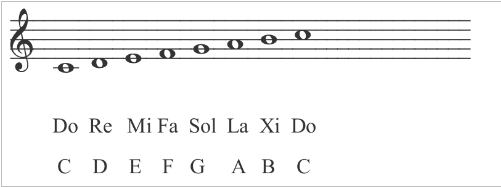

# Python Basics

You need to read [our Python Basics lesson](LESSON.md) first.

Clone the Git repository `intek-sm-python_basics.git` in your `Devel` repository:

```bash
$ cd ~/Devel
$ git clone `http://gitlab.intek.edu.vn/sm/intek-sm-python_basic-playground/{{username}}.git`.
$ cd {{username}}
```

_Note: `{{username}}` corresponds to your username without `{{` and `}}`._

Create a file `python_basics.py` where you will write in all the functions of this mission.

# Waypoint 1: Say Greeting

Write a function `hello` that takes one argument `name` (a string) and that returns a string composed of `'Hello '` concatenated with the argument `name` and concatenated with the character `'!'`.

For examples:

```python
>>> hello('world')
'Hello world!'
>>> name = input('What is your name? ')
What is your name? LÝ Thanh Phú!
>>> hello(name)
'Hello LÝ Thanh Phú!'
```

Make sure that your function [removes leading and trailing whitespace characters](https://docs.python.org/3.7/library/stdtypes.html#str.strip) from the argument `name`.

For examples:

```python
>>> hello('     Jack Carver')
'Hello Jack Carver!'
>>> hello('Jack Carver   ')
'Hello Jack Carver!'
>>> hello('   Jack Carver       ')
'Hello Jack Carver!'
```

# Waypoint 2: Pythagorean Theorem

Write a function `calculate_hypotenuse` that takes two arguments `a` and `b` (integers or floats) representing the length of the two sides of a [right triangle](https://en.wikipedia.org/wiki/Right_triangle), and that returns the length of the [hypotenuse](https://en.wikipedia.org/wiki/Hypotenuse). You will use the [Pythagorean theorem](https://en.wikipedia.org/wiki/Pythagorean_theorem).

For examples:

```python
>>> calculate_hypotenuse(1, 1)
1.0
>>> calculate_hypotenuse(3, 4)
5.0
>>> calculate_hypotenuse(8, 10)
12.806248474865697
```

_Note: you will need to [import](https://docs.python.org/3/reference/simple_stmts.html#import) the Python Standard Library module [`math`](https://docs.python.org/3.7/library/math.htm) at the beginning of your Python file in order to use the square root function [`sqrt`](https://docs.python.org/3.7/library/math.html#math.sqrt`)._

# Waypoint 3: Test whether all Conditions are True

Write a function `are_all_conditions_true` that takes an argument `conditions` (a list of booleans) and returns `True` if all the booleans of this list are `True`, otherwise the function returns `False`.

If the argument `conditions` is an empty list, the function `are_all_conditions_true` returns `None`.

For examples:

```python
>>> are_all_conditions_true([True, True, False, True, False, False, True])
False
>>> are_all_conditions_true([True, True, True])
True
>>> print(are_all_conditions_true([]))
None
```

# Waypoint 4: Test whether at least one Condition is True

Write a function `is_a_condition_true` that takes an argument `conditions` (a list of booleans) and returns `True` if at least one boolean of this list is `True`, otherwise the function returns `False`.

If the argument `conditions` is an empty list, the function `is_a_condition_true` returns `None`.

For examples:

```python
>>> is_a_condition_true([True, True, False, True, False, False, True])
True
>>> is_a_condition_true([True, True, True])
True
>>> is_a_condition_true([False, False])
False
>>> print(is_a_condition_true([]))
None
```

# Waypoint 5: Filter List of Integers

Write a function `filter_integers_greater_than` that takes two arguments `l` (a list of integers) and `n` (an integer), and returns a list of integers, taken from the initial list `l`, greater than `n`.

```python
>>> l = [0, 3, 5, -2, 9, 8]
>>> filter_integers_greater_than(l, 4)
[5, 9, 8]
>>> filter_integers_greater_than(l, 6)
[9, 8]
```

# Waypoint 6: Find Cheapest Hotels

Write a function `find_cheapest_hotels` that takes two arguments `hotel_daily_rates` and `maximum_daily_rate` where:

- `hotel_daily_rates`: a list of hotels and their respective daily rate represented by tuples `(hotel_name, daily_rate)` where:
  - `hotel_name`: the first element of the tuple, a string, representing the name of an hotel;
  - `daily_rate`: the second element of the tuple, an integer or float, representing the daily rate (in USD) of this hotel.
- `maximum_daily_rate`: an integer or a float representing the maximum daily rate the user is willing to pay for one day at an hotel.

The function returns a list of names of the hotels which daily rate is least or equal to the argument `maximum_daily_rate`. These list of hotel names is _[sorted by the ascending](https://docs.python.org/3/library/functions.html#sorted) daily rate_ of these hotels, i.e., from the cheapest hotels to the most expensive.

For examples:

```python
>>> hotel_daily_rates = [
...    ('Majestic Saigon Hotel', 93),
...    ('Hotel Grand Saigon', 80),
...    ('Sofitel Saigon Plaza', 123),
...    ('Hotel Continental', 62),
...    ('Caravelle Hotel', 180),
...    ('Sheraton Saigon Hotel', 216),
...    ('Park Hyatt Saigon', 209)
... ]
>>> find_cheapest_hotels(hotels, 50)
[]
>>> find_cheapest_hotels(hotels, 80)
['Hotel Continental', 'Hotel Grand Saigon']
>>> find_cheapest_hotels(hotels, 150)
['Hotel Continental', 'Hotel Grand Saigon', 'Majestic Saigon Hotel', 'Sofitel Saigon Plaza']
```

# Waypoint 7: Calculate Distance between two 2D Points

Write a function `calculate_euclidean_distance_between_2_points` that takes two arguments `p1` and `p2`, representing points in a [two-dimensional Cartesian coordinate system](https://en.wikipedia.org/wiki/Cartesian_coordinate_system), and that returns the [Euclidean distance](https://en.wikipedia.org/wiki/Euclidean_distance) between `p1` and `p2`.


The arguments `p1` and `p2` are each represented with a tuple of 2 integers or floats `(x, y)` where `x` corresponds to the position of the point on the X-axe (i.e, abscissa), and `y` corresponds to the position of the point on the Y-axe (i.e., ordinate).

For examples:

```python
>>> calculate_euclidean_distance_between_2_points((1, 2), (1, 2))
0.0
>>> calculate_euclidean_distance_between_2_points((0, 0), (3, 4))
5.0
>>> calculate_euclidean_distance_between_2_points((1, 1), (2, 2))
1.4142135623730951
```

# Waypoint 8: Calculate Distance between several 2D Points

Write a function `calculate_euclidean_distance_between_points` that takes an arguments `points`, representing a list of points in a [two-dimensional Cartesian coordinate system](https://en.wikipedia.org/wiki/Cartesian_coordinate_system), and that returns the sum of the [Euclidean distance](https://en.wikipedia.org/wiki/Euclidean_distance) between each consecutive points in this list.

Each point in the list is represented with a named tuple of 2 integers or floats `(x, y)` where `x` corresponds to the position of the point on the X-axe (i.e, abscissa), and `y` corresponds to the position of the point on the Y-axe (i.e., ordinate).

The function raises an[ exception `ValueError`](https://docs.python.org/3.7/library/exceptions.html#ValueError) if the given list contains less than 2 points.

For examples:

```python
>>> calculate_euclidean_distance_between_points([(0, 0), (3, 4)])
5.0
>>> calculate_euclidean_distance_between_points([(0, 0), (3, 4), (0, 0)])
10.0
>>> calculate_euclidean_distance_between_points([(0, 0), (3, 4), (-1, -1)])
11.403124237432849
>>> calculate_euclidean_distance_between_points([])
Traceback (most recent call last):
  File "<input>", line 1, in <module>
  File "<input>", line 4, in calculate_euclidean_distance_between_points
ValueError: The list MUST contain at least 2 points
>>> calculate_euclidean_distance_between_points([(1, 1)])
Traceback (most recent call last):
  File "<input>", line 1, in <module>
  File "<input>", line 4, in calculate_euclidean_distance_between_points
ValueError: The list MUST contain at least 2 points
```

_Note: we strongly encourage you to use the function `calculate_euclidean_distance_between_2_points` that you have written in the previous waypoint._

_Note: have you considered using a [list comprehension](https://medium.com/better-programming/list-comprehension-in-python-8895a785550b) and the built-in function [`sum`](https://docs.python.org/3.7/library/functions.html?#sum)? That would be a good catch!._

# Waypoint 9: Capitalize the Words of a String

Write a function `capitalize_string` which behavior is described by the following [epydoc documentation](http://epydoc.sourceforge.net/epytextintro.html):

```python
def capitalize_words(s):
    """Return a copy of the string with all the words capitalized.

    This function sets the first character in each word of the string `s`
    to uppercase and the rest to lowercase.

    The function removes any duplicate whitespace characters between
    words.

    If `None` is passed, the function returns `None`.

    @param s: a string that possibly contains words separated by whitespace
        characters.

    @return: a string where the first character in each word of the string
        `s`has been converted to uppercase and all remaining characters of
        this word have been converted to lowercase.

    @raise TypeError: if the argument `s` is not a string.
    """
```

For examples:

```python
>>> capitalize_words('hello, word!')
'Hello, Word!'
>>> capitalize_words('JACK CARVER')
'Jack Carver'
>>> capitalize_words('   ')
''
>>> capitalize_words('Không  có gì    quý hơn  độc lập      tự do')
'Không Có Gì Quý Hơn Độc Lập Tự Do'
>>> print(capitalize_string(None))
None
>>> capitalize_words(69)
Traceback (most recent call last):
  File "<input>", line 1, in <module>
  File "<input>", line 23, in capitalize_string
TypeError: Not a string
```

_Note: You may wonder how to convert characters to upper or lower case. Python provides [many functions](https://docs.python.org/3/library/stdtypes.html#string-methods) to process strings. You need to search which function(s) could be useful for this waypoint._

# Waypoint 10: Uppercase and Lowercase Words

Write a function `uppercase_lowercase_words` that takes an argument `s` (a string) and that returns a copy of this string with the words converted to uppercase or lowercase depending on their position in the string (starting with `0`):

- Words at **even position** are converted to **uppercase**;
- Words at **odd position** are converted to **lowercase**.

Let's consider the word composition of the string "`Lorem ipsum dolor sit amet`":

| Position | Word      |
| -------- | --------- |
| 0        | "`Lorem`" |
| 1        | "`ipsum`" |
| 2        | "`dolor`" |
| 3        | "`sit`"   |
| 4        | "`amet`"  |

The function `uppercase_lowercase_words` returns the string `"LOREM ipsum DOLOR sit AMET"`.

The function raises the exception `TypeError` if the argument `s` is not a string.

Other examples:

```python
>>> uppercase_lowercase_words('one two three four five')
'ONE two THREE four FIVE'
>>> uppercase_lowercase_words('SIX SEVEN EIGHT NINE TEN')
'SIX seven EIGHT nine TEN'
>>> upper_lower_words('1 one two 2 3 three four 4 five six')
'1 one TWO 2 3 uppercase_lowercase_words FOUR 4 FIVE six'
>>> upper_lower_words('   ')
''
>>> print(uppercase_lowercase_words(None))
None
>>> uppercase_lowercase_words(69)
Traceback (most recent call last):
  File "<input>", line 1, in <module>
  File "<input>", line 23, in uppercase_lowercase_words
TypeError: Not a string
```

# Waypoint 11: Factorial

In mathematics, the **factorial** of a positive integer `n`, denoted by `n!`, is the product of all positive integers less than or equal to `n`:

```text
n! = n × (n - 1) × (n - 2) × ... × 3 × 2 × 1
```

For example:

```text
5! = 5 × 4 × 3 × 2 × 1 = 120
```

The value of `0!` is `1`, according to the convention for an [empty product](https://en.wikipedia.org/wiki/Empty_product).

Write a function `factorial` that takes an argument `n` (an integer) and that returns the factorial of `n`.

The function raises the exception `TypeError` if the argument `n` is not an integer.

The function raises the exception `ValueError` if the argument `n` is not a positive integer.

For examples:

```python
>>> [(n, factorial(n)) for n in range(6)]
[(0, 1),
 (1, 1),
 (2, 2),
 (3, 6),
 (4, 24),
 (5, 120)]
>>> factorial('3')
Traceback (most recent call last):
  File "<input>", line 1, in <module>
  File "<input>", line 33, in factorial
TypeError: Not an integer
>>> factorial(-2)
Traceback (most recent call last):
  File "<input>", line 1, in <module>
  File "<input>", line 36, in factorial
ValueError: Not a positive integer
```

# Waypoint 12: Convert a Digit Character to an Integer

Write a function `char_to_int` that takes an argument `c` corresponding to a single digit character, and returns an integer representing the numerical value of this character.

If the argument `c` is not a string, the function raises the exception `TypeError`.

If the argument `c` is a string but it doesn't only contain 1 character or this character is not a [digit](https://docs.python.org/3/library/stdtypes.html?highlight=isdigit#str.isdigit), the function raises the exception `ValueError`.

You **MUST NOT** use the [built-in function int](https://docs.python.org/3/library/functions.html#int).

For example:

```python
>>> char_to_int('4')
4
>>> char_to_int(None)
Traceback (most recent call last):
  File "<input>", line 1, in <module>
  File "<input>", line 15, in char_to_int
TypeError: Not a string
>>> char_to_int(13.4)
Traceback (most recent call last):
  File "<input>", line 1, in <module>
  File "<input>", line 15, in char_to_int
TypeError: Not a string
>>> char_to_int('12')
Traceback (most recent call last):
  File "<input>", line 1, in <module>
  File "<input>", line 18, in char_to_int
ValueError: Not a single digit
```

_Hint: You might want to use the string function [ord](https://docs.python.org/3/library/functions.html#ord)._

_Hint 2: The characters you see on your screen are actually represented with numbers in the memory of your computer. Simply put, characters are organized in a *table of characters*. One of the first tables is the [ASCII table](https://en.wikipedia.org/wiki/ASCII) (1963), originally based on the English alphabet, which includes digits `0` to `9`, lowercase letters `a` to `z`, uppercase letters `A` to `Z` (and punctuation symbols). Digit characters ordered by their **ascending** value; letter characters are **alphabetically** ordered. Each character is given an ordinal position in the table. For example, the ordinal position of the character "`A`" is `65`, the ordinal position of each digit character "`0`" to "`9`" is:_

```python
>>> import string
>>> string.digits
'0123456789'
>>> [(d, ord(d)) for d in string.digits]
[('0', 48), ('1', 49), ('2', 50), ('3', 51), ('4', 52), ('5', 53), ('6', 54), ('7', 55), ('8', 56), ('9', 57)]
```


# Waypoint 13: Convert a String of Digit Characters to an Integer

Write a function `string_to_int` that takes an argument `s` corresponding to a string of digit characters, and returns an integer representing the numerical value of this string.

If the argument `s` is not a string, the function raises the exception `TypeError`.

If the argument `s` is a string but it doesn't only contain digit characters, the function raises the exception `ValueError`.

You **MUST** use the function `char_to_int` that we have written in the previous waypoint.

```python
>>> string_to_int('17049171')
17049171
>>> string_to_int(None)
Traceback (most recent call last):
  File "<input>", line 1, in <module>
  File "<input>", line 19, in string_to_int
TypeError: Not a string
>>> string_to_int(1984)
Traceback (most recent call last):
  File "<input>", line 1, in <module>
  File "<input>", line 19, in string_to_int
TypeError: Not a string
>>> string_to_int('123abcd')
Traceback (most recent call last):
  File "<input>", line 1, in <module>
  File "<input>", line 22, in string_to_int
ValueError: Not a positive integer string expression
>>> string_to_int('-1234')
Traceback (most recent call last):
  File "<input>", line 1, in <module>
  File "<input>", line 22, in string_to_int
ValueError: Not a positive integer string expression
```

# Waypoint 14: Test Palindrome String

Write a function `is_palindrome` that takes an argument `value` of any type and that returns `True` is the string representation of this value is a [palindrome](https://en.wikipedia.org/wiki/Palindrome) or `False` otherwise.

The function only retains ASCII letter characters ([`string.ascii_letters`](https://docs.python.org/3.7/library/string.html#string.ascii_letters)) and digits ([`string.digits`](https://docs.python.org/3.7/library/string.html#string.digits)). It ignores any other characters.

The function is not [case-sensitive](https://en.wikipedia.org/wiki/Case_sensitivity), i.e, uppercase and lowercase characters are treated as equivalent.

For examples:

```python
>>> is_palindrome('madam')
True
>>> is_palindrome('racecar')
True
>>> is_palindrome(10801)
True
>>> is_palindrome(1.947491)
True
>>> is_palindrome(1984)
False
>>> is_palindrome('Hello, word!')
False
>>> is_palindrome('A man, a plan, a canal, Panama!')
True
>>> is_palindrome('Was it a car or a cat I saw?')
True
>>> is_palindrome("No 'x' in Nixon")
True
```

# Waypoint 15: Convert Roman Numerals to Integer

## Introduction to Roman Numerals

[Roman numerals](https://en.wikipedia.org/wiki/Roman_numerals) are [a numeral system that originated in ancient Rome](https://www.youtube.com/watch?v=49oWYxExWKE), and in which the numbers are represented by combinations of letters from the Latin alphabet:

| Symbol | Value |
| ------ | ----- |
| `N`    | 0     |
| `I`    | 1     |
| `V`    | 5     |
| `X`    | 10    |
| `L`    | 50    |
| `C`    | 100   |
| `D`    | 500   |
| `M`    | 1,000 |

[Roman numerals](https://youtu.be/ByVrkHakTm0) are a decimal number system. Thousands, hundreds, tens, and units are written separately, from left to right, in that order. Different symbols are used for each power of ten, but a common pattern is used for each of them.

The following numbers are written using an "additive" notation:

| Unit | Roman numeral | Description                          |
| ---- | ------------- | ------------------------------------ |
| 1    | `I`           |                                      |
| 2    | `II`          | `I` (1) + `I` (1)                    |
| 3    | `III`         | `I` (1) + `I` (1) + `I` (1)          |
| 5    | `V`           |                                      |
| 6    | `VI`          | `V` (5) + `I` (1)                    |
| 7    | `VII`         | `V` (5) + `I` (1) + `I` (1)          |
| 8    | `VIII`        | `V` (5) + `I` (1) + `I` (1)+ `I` (1) |
| 10   | `X`           |                                      |

The following numbers are written using a "subtractive" notation:

| Roman numeral | Numerical value | Description                |
| ------------- | --------------- | -------------------------- |
| `IV`          | 4               | `I` (1) less than `V` (5)  |
| `IX`          | 9               | `I` (1) less than `X` (10) |

The multiples of 10, from 10 to 100, are written according to the same pattern, with `X`, `L`, and `C` taking the place of `I`, `V`, and `X`:

| Roman numeral | Numerical value | Pattern                |
| ------------- | --------------- | ---------------------- |
| `X`           | 10              |                        |
| `XX`          | 20              | "Additive" notation    |
| `XXX`         | 30              | "Additive" notation    |
| `XL`          | 40              | "Subtractive" notation |
| `L`           | 50              | "Additive" notation    |
| `LX`          | 60              | "Additive" notation    |
| `LXX`         | 70              | "Additive" notation    |
| `LXXX`        | 80              | "Additive" notation    |
| `XC`          | 90              | "Subtractive" notation |
| `C`           | 100             |

Similarly, the multiples of 100, 100 to 1000, are written as:

| Roman numeral | Numerical value |
| ------------- | --------------- |
| `C`           | 100             |
| `CC`          | 200             |
| `CCC`         | 300             |
| `CD`          | 400             |
| `D`           | 500             |
| `DC`          | 600             |
| `DCC`         | 700             |
| `DCCC`        | 800             |
| `CM`          | 900             |
| `M`           | 1000            |

Since the Roman numeral system has no standard symbols for 5,000 and 10,000, the full pattern cannot be extended to the multiples of 1000 – restricting the "thousands" range of "normal" Roman numerals to 1,000, 2,000 and 3,000:

| Roman numeral | Numerical value |
| ------------- | --------------- |
| `M`           | 1000            |
| `MM`          | 2000            |
| `MMM`         | 3000            |

The largest number that can be represented in this notation is 3,999 (3,000 + 900 + 90 + 9 = `MMM` + `CM` + `XC` + `IX` = `MMMCMXCIX`).

## Python Function to Return the Numerical Value of a Roman Numeral

Write a function `roman_numeral_to_int` that take an argument `roman_numeral` (a string) and that returns the integer value corresponding to this Roman numeral.

The function raises the exception `TypeError` if the argument `roman_numeral` is not a string.

The function raises the exception `ValueError` if the argument `roman_numeral` is an empty string or some characters of the string `roman_numeral` don't represent Roman numeral symbols.

For example:

```python
>>> roman_numeral_to_int('XXXIX')
39
>>> roman_numeral_to_int('CCXLVI')
246
>>> roman_numeral_to_int('DCCLXXXIX')
789
>>> roman_numeral_to_int('MMCDXXI')
2421
>>> roman_numeral_to_int('CLX')
160
>>> roman_numeral_to_int('CCVII')
207
>>> roman_numeral_to_int('MIX')
1009
>>> roman_numeral_to_int('MLXVI')
1066
>>> roman_numeral_to_int('MDCCLXXVI')
1776
>>> roman_numeral_to_int('MCMLIV')
1954
>>> roman_numeral_to_int('MMXIV')
2014
>>> roman_numeral_to_int('MMMCMXCIX')
3999
>>> roman_numeral_to_int(1234)
Traceback (most recent call last):
  File "<input>", line 1, in <module>
  File "<input>", line 3, in roman_numeral_to_int
TypeError: Not a string
>>> roman_numeral_to_int('XYZ')
Traceback (most recent call last):
  File "<input>", line 1, in <module>
  File "<input>", line 10, in roman_numeral_to_int
ValueError: Not a Roman numeral
```

_Note: despite the fact Roman numerals seem complicated, the function to return the numerical value of a Roman numeral is pretty simple. If your function starts to contain a lot of Python code with a lot of `if` statements, you may be overcomplicated your code._

_Hint: A Roman numeral is written from left to right, with symbols of decreasing numerical value ("additive" notation); if a symbol has a greater value than the symbol it follows, then this is the "subtractive" notation._

# Waypoint 16: Play a Melody

We would like to play simple kids melodies such as "Itsy Bitsy Spider", "Old Mcdonald Had A Farm", "Twinkle Twinkle Little Star", etc.

## Basic Notions of Music

A [**melody**](https://en.wikipedia.org/wiki/Melody) is a linear succession of [**notes**](https://en.wikipedia.org/wiki/Musical_note). For example, [Für Elise](https://en.wikipedia.org/wiki/F%C3%BCr_Elise), for solo piano, is one of Ludwig van Beethoven's [most popular composition](https://www.youtube.com/watch?v=_mVW8tgGY_w)s.

In most countries in the world, notes are represented with the names `do`, `re`, `mi`, `fa`, `sol`, `la`, and `si`. However, in English, the notes are typically represented by the first seven [letters of the Latin alphabet](https://www.youtube.com/watch?v=zvuNlN9WBYc) `A`, `B`, `C`, `D`, `E`, `F`, and `G`.

|                              |                             |
| ---------------------------- | --------------------------- |
|  |  |

Simply put, notes are organized in [**octaves**](https://www.youtube.com/watch?v=fV-p9n7upMc). Technically speaking, an [octave is the interval](https://en.wikipedia.org/wiki/Octave) between one musical pitch (a note) and another with double its frequency, i.e., 8 notes.

In music notation, notes separated by one or more octaves have the same letter name `A`, `B`, `C`, `D`, `E`, `F`, and `G`. To differentiate two notes that fall into different octaves, the system of [international pitch notation (IPN)](https://en.wikipedia.org/wiki/Scientific_pitch_notation) combines a letter name with a number designating a specific octave. For examples: `F2`, `B5`, `F6`, `D8`.


_Note: The order of the musical notes (that fall in a same octave) by ascending pitch is `C`, `D`, `E`, `F`, `G`, `A`, `B`._

An [accidental](https://www.youtube.com/watch?v=r9JS_vZOGVg) in music is a symbol that indicates the modification of a note. The most commonly used accidentals in music are the [**sharp** (♯)](<https://en.wikipedia.org/wiki/Sharp_(music)>) that raises a note by a semitone, and the [**flat** (♭)](<https://en.wikipedia.org/wiki/Flat_(music)>) that lowers a note by the same amount.

The accidentals are written after the note name. For examples, F♯ represents F-sharp, B♭ is B-flat.

_Note: For practical reason, we will use the character `#` and `b` to represent the accidentals **sharp** (♯) and **flat** (♭). Accidentals would be easier to type on a computer keyboard. For instance `E♭5` is noted `Eb5`, and `F♯6` is noted `F#6`._

We represent a melody in Python as a tuple of notes represented with strings in the international pitch notation. For example, the Für Elise is represented with the following tuple:

```python
MELODY_FUR_ELISE = (
    'E5', 'Eb5', 'E5', 'Eb5', 'E5', 'B4', 'D5', 'C5', 'A4',
    'C4', 'E4', 'A4', 'B4',
    'E4', 'Ab4', 'B4', 'C5',
    'E4', 'E5', 'Eb5', 'E5', 'Eb5', 'E5', 'B4', 'D5', 'C5', 'A4',
    'C4', 'E4', 'A4', 'B4',
    'E4', 'C5', 'B4', 'A4',
    'E5', 'Eb5', 'E5', 'Eb5', 'E5', 'B4', 'D5', 'C5', 'A4',
    'C4', 'E4', 'A4', 'B4',
    'E4', 'Ab4', 'B4', 'C5',
    'E4', 'E5', 'Eb5', 'E5', 'Eb5', 'E5', 'B4', 'D5', 'C5', 'A4',
    'C4', 'E4', 'A4', 'B4',
    'E4', 'C5', 'B4', 'A4',
    'B4', 'C5', 'D5', 'E5',
    'G4', 'F5', 'E5', 'D5',
    'F4', 'E5', 'D5', 'C5',
    'E4', 'D5', 'C5', 'B4',
    'E4', 'E5',
    'E4', 'E5', 'Eb5', 'E5', 'Eb5', 'E5', 'Eb5', 'E5', 'Eb5', 'E5', 'Eb5', 'E5', 'Eb5', 'E5', 'B4', 'D5', 'C5', 'A4',
    'C4', 'E4', 'A4', 'B4',
    'E4', 'Ab4', 'B4', 'C5',
    'E4', 'E5', 'Eb5', 'E5', 'Eb5', 'E5', 'B4', 'D5', 'C5', 'A4',
    'C4', 'E4', 'A4', 'B4',
    'E4', 'C5', 'B4', 'A4',
)
```

## Playing Sound with Python

It's time to write code to play some melodies!

However, you might wonder how to play sounds with Python. It's quite simple! We are going to use [`pygame`](https://www.pygame.org/), a cross-platform set of Python modules designed for writing video games. It includes computer graphics and sound libraries.

First, we need to install this third-party Python library in our project:

```bash
# Make sure that we are in our project's directory.
$ cd ~/Devel/intek-sm-python_basics
# Make sure that we have created a Python virtual environment.
$ pipenv shell --three
# Install pygame in our project.
$ pipenv install pygame
```

Then, we can use this library to play the sound `duke_nukem_groovy.mp3` that Intek has included in the Git repository that you have cloned.

We need to import the module `pygame` and to [initialize all imported pygame modules](https://www.pygame.org/docs/ref/pygame.html?#pygame.init):

```python
>>> import pygame
pygame 1.9.6
Hello from the pygame community. https://www.pygame.org/contribute.html
>>> pygame.init()
(6, 0)
```

We can now [load our sound file](https://www.pygame.org/docs/ref/mixer.html#pygame.mixer.Sound) `duke_nukem_groovy.ogg` and [play it](https://www.pygame.org/docs/ref/mixer.html#pygame.mixer.Sound.play):

```python
>>> sound = pygame.mixer.Sound('./duke_nukem_groovy.ogg')
>>> channel = sound.play()
```

Groovy!


## Melody Player

You will find in the directory `./sounds/piano` a collection of audio files with the [extension `.ogg`](https://en.wikipedia.org/wiki/Ogg). Each file corresponds the sound of a note. The file of a note is named (lowercase) against this note using the international pitch notation. For instance, the file `eb5.ogg` corresponds to the note `E♭5`.

Write a function `play_melody` that takes 2 arguments `melody` and `sound_basedir` where:

- `melody`: A collection ([iterable](https://hackernoon.com/how-iterables-actually-work-in-python-65c36ff91c1e)) of notes, named after the international pitch notation, of the melody to play;
- `sound_basedir`: A string representing the path of the directory containing the note sound files. The function `play_melody` uses this parameter to find and load each note sound file.

The function successively plays each note of the melody at the speed you want. We suggest you to play each note for 400ms, but it's totally up to you.

The function returns a list of the file pathname of the notes that have been played one after the other.

For example:

```python
>>> MELODY_I_LOVE_YOU = [
...     'G3', 'E3', 'G3', 'G3', 'E3', 'G3',
...     'A3', 'G3', 'F3', 'E3', 'D3', 'E3', 'F3',
...     'E3', 'F3', 'G3', 'C3', 'C3', 'C3', 'C3', 'C3', 'D3', 'E3', 'F3', 'G3',
...     'G3', 'D3', 'D3', 'F3', 'E3', 'D3', 'C3',
...     'G3', 'E3', 'G3', 'G3', 'E3', 'G3',
...     'A3', 'G3', 'F3', 'E3', 'D3', 'E3', 'F3',
...     'E3', 'F3', 'G3', 'C3', 'C3', 'C3', 'C3', 'C3', 'D3', 'E3', 'F3', 'G3',
...     'G3', 'D3', 'D3', 'F3', 'E3', 'D3', 'C3',
... ]
>>> play_melody(MELODY_I_LOVE_YOU, './sounds/piano')
['./sounds/piano/G3.ogg',
 './sounds/piano/E3.ogg',
 './sounds/piano/G3.ogg',
 './sounds/piano/G3.ogg',
 ...
 './sounds/piano/F3.ogg',
 './sounds/piano/E3.ogg',
 './sounds/piano/D3.ogg',
 './sounds/piano/C3.ogg']
```

_Note: your function may only play a few notes, and then, you don't hear anything. The reason of this phenomenon is that `pygame` only supports 8 channels by default, i.e., it can only play 8 notes at the same time._

_You might think that you are playing notes one after one other, but your code may be playing a new note while the previous note is stilly playing. If you look closely to the `.ogg` files, the total duration of a note is several seconds._


_If your code plays a note, waits for 400ms, and plays a second note, your code is actually playing 2 notes at the same time. Your code may end up trying to play more than 8 notes at the same time, i.e., more than the number of sounds that `pygame` can play simultaneously._

_To fix this issue, your code must request `pygame` to [stop](https://www.pygame.org/docs/ref/mixer.html#pygame.mixer.Sound.stop) playing the current note [after](https://www.pygame.org/docs/ref/time.html?highlight=delay#pygame.time.delay) 400ms, or your code must request `pygame` to [play a note and stop playback](https://www.pygame.org/docs/ref/mixer.html#pygame.mixer.Sound.play) after 400ms._

## Melody Player: Improvement

You may have noticed that the directory `./sounds/piano` doesn't contain accidental **sharp** (♯) notes. It only contain accidentals **flat** (♭) notes.

We have said that accidental **sharp** (♯) raises a note by a semitone, while accidental **flat** (♭) lowers a note by the same amount. It means that a note with the accidental **sharp** is equivalent to the next note with the accidental **flat**. For instance, `F♯4` is equivalent to `G♭4`.

We would like to play the melody [_Happy Birthday to You_](https://youtu.be/w46_xPKgPHE?t=5) but the version of this melody we have is given with accidental **sharp** (♯) notes:

```python
MELODY_HAPPY_BIRTHDAY_TO_YOU = (
    'C4', 'C4', 'D4', 'C4', 'F4', 'E4',
    'C4', 'C4', 'D4', 'C4', 'G4', 'F4',
    'C4', 'C4', 'C5', 'A4', 'F4', 'E4', 'D4',
    'A#4', 'A#4', 'A4', 'F4', 'G4', 'F4',
)
```

Our current version of the function `play_melody` fails to play this melody, because it doesn't find the files for accidental **sharp** (♯) notes. Your code may raise an exception as the following:

```python
>>> play_melody(MELODY_HAPPY_BIRTHDAY_TO_YOU, './sounds/piano')
Traceback (most recent call last):
  File "<input>", line 1, in <module>
  File "<input>", line 18, in play_melody
KeyError: 'a#4'
```

Update the function `play_melody` so that accidental **sharp** (♯) notes are replaced with the equivalent accidental **flat** (♭) notes, in order the function `play_melody` can play the melody.

The function returns a list of the file pathname of the notes that have been played one after the other, where the accidental **sharp** (♯) notes have been replaced with the equivalent accidental **flat** (♭) notes.

For example:

```python
MELODY_HAPPY_BIRTHDAY_TO_YOU = (
    'C4', 'C4', 'D4', 'C4', 'F4', 'E4',
    'C4', 'C4', 'D4', 'C4', 'G4', 'F4',
    'C4', 'C4', 'C5', 'A4', 'F4', 'E4', 'D4',
    'A#4', 'A#4', 'A4', 'F4', 'G4', 'F4',
)
>>> play_melody(MELODY_HAPPY_BIRTHDAY_TO_YOU, './sounds/piano')
['./sounds/piano/c4.ogg',
 './sounds/piano/c4.ogg',
 './sounds/piano/d4.ogg',
 ...
 './sounds/piano/bb4.ogg',
 './sounds/piano/bb4.ogg',
 ...
 './sounds/piano/f4.ogg',
 './sounds/piano/g4.ogg',
 './sounds/piano/f4.ogg']
```

_Hint: If you have no idea how to convert the string of an accidental **flat** (♭) note equivalent to the string of an accidental **sharp** (♯) note, you should revise how to use [Python strings](https://www.digitalocean.com/community/tutorials/how-to-index-and-slice-strings-in-python-3) and [Python lists](https://www.digitalocean.com/community/tutorials/how-to-use-list-methods-in-python-3)._
